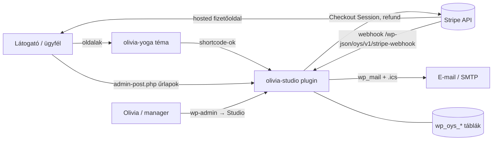
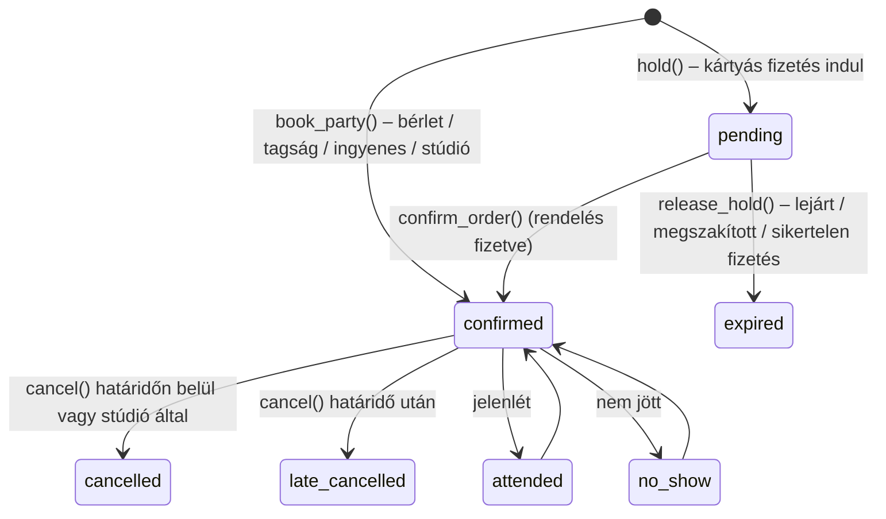
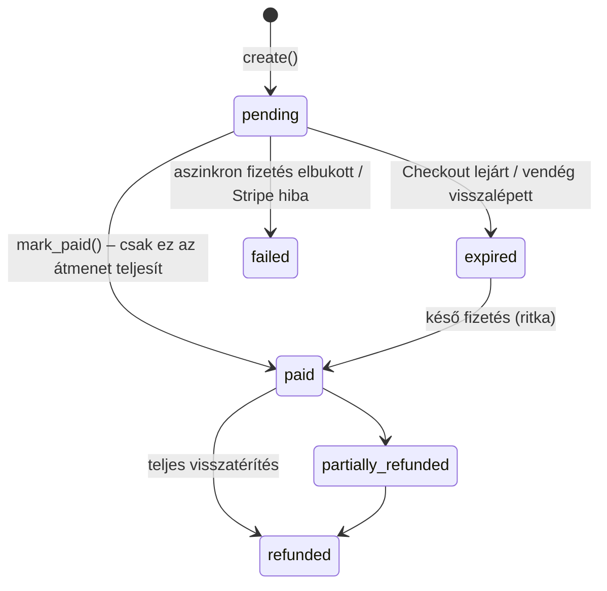
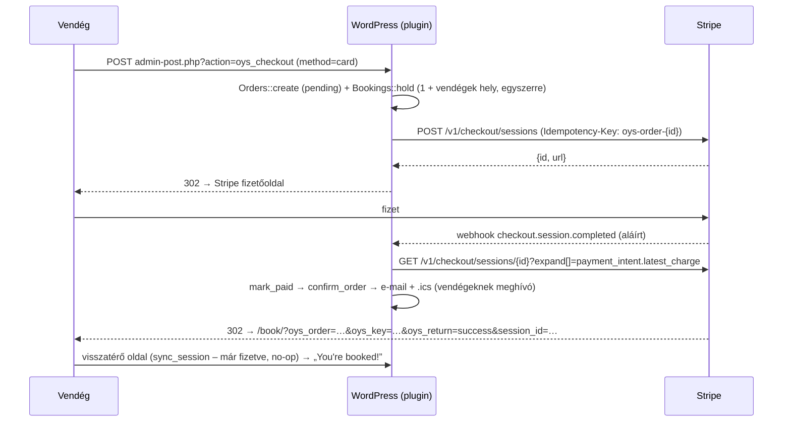
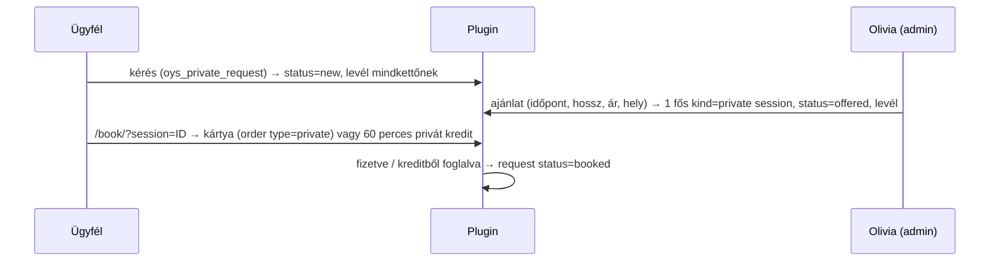
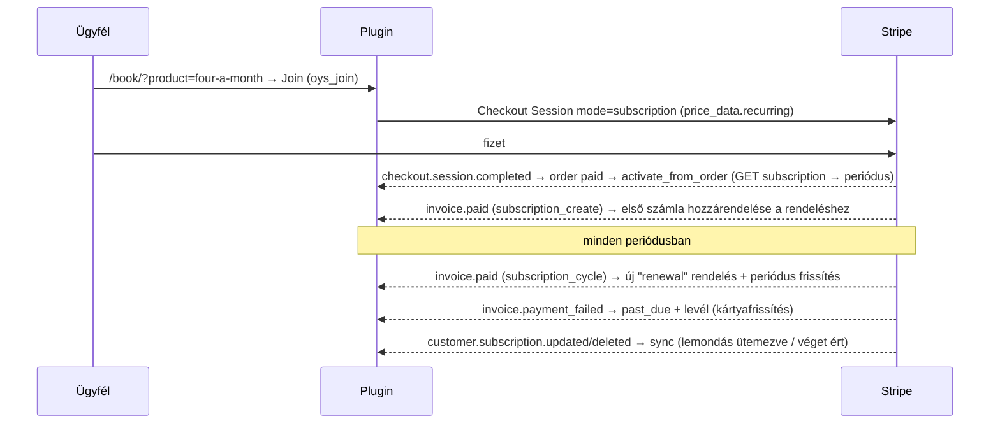

# Fejlesztői dokumentáció – Olivia Kovács Yoga (WordPress)

Ez a dokumentum annak szól, aki a kódot továbbfejleszti vagy üzemelteti. A felhasználói telepítési és élesítési lépések a [README.md](README.md)-ben vannak; itt azt írjuk le, **hogyan működik belülről** és **hogyan kell hozzányúlni**.

Tartalom

1. [Áttekintés](#1-áttekintés)
2. [Repó felépítése](#2-repó-felépítése)
3. [Fejlesztői környezet](#3-fejlesztői-környezet)
4. [Plugin: architektúra](#4-plugin-olivia-studio--architektúra)
5. [Adatmodell](#5-adatmodell)
6. [Folyamatok és állapotgépek](#6-folyamatok-és-állapotgépek)
7. [Stripe integráció](#7-stripe-integráció)
8. [Nyilvános felület: shortcode-ok és űrlapkezelők](#8-nyilvános-felület-shortcode-ok-és-űrlapkezelők)
9. [Admin felület](#9-admin-felület-studio-menü)
10. [Háttérfeladatok (cron)](#10-háttérfeladatok-cron)
11. [E-mailek](#11-e-mailek)
12. [Hookok (bővítési pontok)](#12-hookok-bővítési-pontok)
13. [Téma: olivia-yoga](#13-téma-olivia-yoga)
14. [Statikus előnézet (src/build.py)](#14-statikus-előnézet-srcbuildpy)
15. [Biztonság](#15-biztonság)
16. [Tesztelés](#16-tesztelés)
17. [Kiadás és telepítés](#17-kiadás-és-telepítés)
18. [Gyakori bővítések – receptek](#18-gyakori-bővítések--receptek)
19. [Ismert korlátok, technikai adósság](#19-ismert-korlátok-technikai-adósság)
20. [Konvenciók](#20-konvenciók)

---

## 1. Áttekintés

Két, egymástól elválasztott komponens:

| Komponens | Mappa | Felelősség |
|---|---|---|
| **olivia-studio** (plugin) | `wordpress/olivia-studio/` | Minden üzleti logika: órarend, foglalás vendégekkel, fizetés (Stripe), bérletek, tagság (előfizetés), várólista, magánórák, ajándékkártya, ügyfélfiók, e-mailek, admin, belépés-védelem. |
| **olivia-yoga** (téma) | `wordpress/olivia-yoga/` | Megjelenés és tartalom: sablonok, dizájn (CSS/JS), óratípusok és GYIK tartalomtípus, SEO, tartalombetöltő. |

A téma **nem tartalmaz üzleti logikát**, a plugin **nem tartalmaz dizájnt** (csak a saját felületeihez alap CSS-t, ami a téma CSS-változóit használja). A kettő szűrőkön (filter) keresztül beszél egymással (lásd [12.](#12-hookok-bővítési-pontok)), így a plugin más témával is működik, a téma pedig plugin nélkül is betölt (a foglalási részek helyén üres hely vagy „coming soon” szöveg jelenik meg).

Technológia: WordPress 6.4+ (tesztelve: 6.8.3), PHP 8.1+ (tesztelve: 8.4), MySQL/MariaDB (tesztelve: MariaDB 10.11), Stripe REST API (SDK nélkül). Nincs build lépés, nincs Composer/npm függőség a futáshoz.



---

## 2. Repó felépítése

```
oliv/
├── src/                     Statikus előnézet generátora (Python) – dizájn-referencia
│   ├── build.py
│   ├── content.json         Jóváhagyott szövegek (oldalak, órák, GYIK, cikkek, minta órarend/árak)
│   ├── site.css / site.js   Az „Urban flow” dizájn forrása
│   └── img/                 Fotók 600/1200 px + images.json (alt, fókuszpont)
├── site/                    A generált statikus oldal (19 oldal)
├── preview.html             Egyfájlos előnézet (artifact) – gitignore
├── olivia-kovacs-yoga.html  Letölthető egyfájlos előnézet
├── JEGYZETEK.md             Projekt-jegyzet (állapot, döntések)
├── .github/workflows/ci.yml GitHub Actions: lint, integrációs és E2E tesztek, app ellenőrzés
├── app/                     iOS app (Expo / React Native) – lásd app/README.md és 6.14
└── wordpress/
    ├── README.md            Telepítés, Stripe, élesítési lista (felhasználói)
    ├── DEVELOPER.md         ← ez a fájl
    ├── dist/                Feltölthető ZIP-ek (plugin, téma)
    ├── dev/                 Csak fejlesztéshez: Stripe-szimulátor, levélfogó, router, telepítő, CI-szkript,
    │                        integrációs tesztek (tests/run.php), böngészős E2E teszt (e2e.js)
    ├── olivia-studio/       Plugin
    │   ├── olivia-studio.php          Belépési pont, include-ok, bootstrap
    │   ├── assets/oys.css             Ügyféloldali felületek stílusa
    │   ├── assets/admin.css           Admin stílus
    │   └── includes/
    │       ├── class-install.php      Táblák (dbDelta), szerepkörök, oldalak létrehozása, verziókezelés
    │       ├── helpers.php            Idő, pénz, URL, flash üzenetek, ikonok
    │       ├── class-settings.php     Beállítások (egy option tömb) + titkos kulcsok
    │       ├── class-products.php     Bérletek/árlista (egy option tömb)
    │       ├── class-schedule.php     Heti sablonok, alkalmak, helyszámlálás
    │       ├── class-passes.php       Bérletek és kreditek
    │       ├── class-bookings.php     Foglalás, tartás, lemondás, jelenlét, várólista
    │       ├── class-orders.php       Rendelések, teljesítés (fulfilment), visszatérítés
    │       ├── class-stripe.php       Stripe API kliens, Checkout, webhook
    │       ├── class-emails.php       Levelek, sablon, .ics
    │       ├── class-customers.php    Regisztráció, belépés, profil, nyilatkozat, wp-admin tiltás
    │       ├── class-privates.php     Magánóra-kérések és ajánlatok
    │       ├── class-gifts.php        Ajándékkártyák
    │       ├── class-memberships.php  Tagság (Stripe előfizetés): csatlakozás, szinkron, keret, lemondás, portál
    │       ├── class-security.php     Belépés- és regisztráció-korlátozás
    │       ├── class-zoom.php         Zoom meetingek automatikusan (Server-to-Server OAuth)
    │       ├── class-email-templates.php  Az automatikus levelek szerkeszthető szövegei, ki/be kapcsolói
    │       ├── class-app-api.php      Mobilapp REST API (oys/v1/app/*), tokenes belépés
    │       ├── admin/class-calendar.php   Admin naptár (REST + oldal)
    │       ├── class-cron.php         Háttérfeladatok
    │       ├── class-frontend.php     Shortcode-ok és nyilvános űrlapkezelők
    │       ├── class-privacy.php      WP adatexport / törlés
    │       └── admin/class-admin.php  Studio admin menü és műveletek
    └── olivia-yoga/         Téma
        ├── style.css                  Téma fejléc (a dizájn az assets/site.css-ben)
        ├── functions.php              Setup, assetek, menü, oldalankénti oldalsáv
        ├── header.php / footer.php
        ├── front-page.php             Főoldal
        ├── page.php                   Aloldalak (+ plugin oldalak: book, account, gift-cards)
        ├── single-oy_class.php        Óratípus oldal + az óra következő időpontjai
        ├── home.php / single.php      Napló (blog) lista és cikk
        ├── index.php / 404.php
        ├── template-parts/cards.php   Cikk-kártyák
        ├── inc/helpers.php            Markup segédek (fotó, matrica, futószalag, gomb, oldalfej)
        ├── inc/content-types.php      oy_class, oy_faq CPT + meta boxok + plugin-szűrők
        ├── inc/shortcodes.php         oy_* shortcode-ok, kapcsolati űrlap
        ├── inc/seo.php                Title, meta, OG, JSON-LD
        ├── inc/demo-import.php        Megjelenés → Olivia setup (tartalombetöltő)
        ├── demo/content.json          A betöltő forrása (= src/content.json másolata)
        └── assets/                    site.css (dizájn), wp.css (WP kiegészítések), site.js, img/
```

---

## 3. Fejlesztői környezet

### 3.1 Helyi WordPress PHP beépített szerverrel (így készült és tesztelődött)

Követelmény: PHP 8.1+ (`mysqli`, `curl`, `gd`), MariaDB/MySQL, Node + Playwright (csak az E2E teszthez).

```bash
# 1) Adatbázis
mariadb -uroot -e "CREATE DATABASE oywp CHARACTER SET utf8mb4;
  CREATE USER 'oy'@'127.0.0.1' IDENTIFIED BY 'oy'; GRANT ALL ON oywp.* TO 'oy'@'127.0.0.1';"

# 2) WordPress (bármilyen forrásból; pl. git)
git clone --depth 1 -b 6.8.3 https://github.com/WordPress/WordPress.git wp && cd wp

# 3) Téma, plugin, levélfogó symlinkkel (így a repóban szerkesztesz)
ln -s /UT/oliv/wordpress/olivia-studio wp-content/plugins/olivia-studio
ln -s /UT/oliv/wordpress/olivia-yoga   wp-content/themes/olivia-yoga
mkdir -p wp-content/mu-plugins && ln -s /UT/oliv/wordpress/dev/mu-plugins/dev-mail-catcher.php wp-content/mu-plugins/
cp /UT/oliv/wordpress/dev/router.php .
```

`wp-config.php` (a lényeges sorok):

```php
define( 'DB_NAME', 'oywp' ); define( 'DB_USER', 'oy' ); define( 'DB_PASSWORD', 'oy' ); define( 'DB_HOST', '127.0.0.1' );
define( 'WP_DEBUG', true ); define( 'WP_DEBUG_LOG', true ); define( 'WP_DEBUG_DISPLAY', false );
define( 'WP_HOME', 'http://127.0.0.1:8080' ); define( 'WP_SITEURL', 'http://127.0.0.1:8080' );
define( 'OYS_STRIPE_API_BASE', 'http://127.0.0.1:8090' );   // Stripe-szimulátor (CSAK helyben!)
define( 'DISABLE_WP_CRON', true );                           // cront kézzel futtatjuk (lásd 10.)
```

```bash
# 4) Szerverek (a WORKERS kell: a webhook és a Stripe-hívás egymásra vár, egy szálon holtpont lenne)
PHP_CLI_SERVER_WORKERS=4 php -S 127.0.0.1:8080 router.php                                  # WordPress
PHP_CLI_SERVER_WORKERS=4 php -S 127.0.0.1:8090 /UT/oliv/wordpress/dev/mock-stripe.php      # Stripe mock
```

5. Böngészőben: telepítés (`/wp-admin/install.php`), időzóna **America/New_York**, közvetlen hivatkozások: **Bejegyzés neve**.
6. Bővítmények → **Olivia Studio** bekapcsolása, Megjelenés → **Olivia Yoga** bekapcsolása.
7. Megjelenés → **Olivia setup** → „Set up the site content”.
8. Studio → Settings: Test secret key = `sk_test_mock`, Test webhook secret = `whsec_mock`.

A levelek küldés helyett a `wp-content/mail-log/` mappába kerülnek (HTML + .ics melléklet).

### 3.2 Hasznos parancsok

```bash
# PHP szintaxis-ellenőrzés az egész kódra
find wordpress -name '*.php' -exec php -l {} \; | grep -v "No syntax errors"

# Cron kézi futtatása (holdok lejárata, emlékeztetők, alkalmak generálása)
php -r 'require "wp-load.php"; OYS_Cron::frequent(); OYS_Cron::hourly();'

# Helyszámlálók újraszámolása egy alkalomra (ha kézzel nyúltál az adatbázishoz)
php -r 'require "wp-load.php"; echo OYS_Schedule::recount(123);'
```

### 3.3 Valódi Stripe teszt-móddal (élesítés előtt kötelező)

Távolítsd el az `OYS_STRIPE_API_BASE` sort, a Settingsbe tedd a saját `sk_test_…` kulcsot. A webhookhoz helyben a Stripe CLI kell:

```bash
stripe listen --forward-to http://127.0.0.1:8080/wp-json/oys/v1/stripe-webhook
# a kiírt whsec_… kerül a "Test webhook signing secret" mezőbe
```

Tesztkártyák: `4242 4242 4242 4242` (sikeres), `4000 0000 0000 9995` (elutasított), `4000 0025 0000 3155` (3D Secure).

---

## 4. Plugin (olivia-studio) – architektúra

- **Osztályok statikus metódusokkal** (`OYS_*`), egy felelősség / fájl. Nincs autoloader: az `olivia-studio.php` include-ol mindent a megfelelő sorrendben.
- **Bootstrap** (`plugins_loaded`): `OYS_Install::maybe_upgrade()` → `init()` a Customers, Stripe, Cron, Frontend, Privacy (és adminban az Admin) osztályokon. A `class-bookings.php`, `class-privates.php`, `class-gifts.php` a fájl végén maga hívja az `init()`-et.
- **Aktiválás**: táblák (`dbDelta`), szerepkörök, alap beállítások és bérletek, oldalak (Book / My account / Gift cards), cron ütemezés.
- **Verziókezelés**: `OYS_DB_VERSION` konstans + `oys_db_version` option. Ha eltér, a `maybe_upgrade()` újrafuttatja az aktiválást (a `dbDelta` csak hozzáad/módosít oszlopot, adatot nem töröl). **Sémaváltozásnál ezt a konstanst emeld.**
- **Időkezelés**: minden dátum **UTC-ben** tárolódik (`Y-m-d H:i:s`), megjelenítéskor a WP időzónájára vált (`oys_date()`, `oys_time()` → `wp_date`). Adminban beírt helyi időből `oys_local_to_utc()` készít UTC-t. A heti sablonok helyi időben értendők, így a nyári/téli időszámítás váltása nem tolja el az órákat.
- **Pénz**: mindig egész **cent** (`*_cents`), pénznem kisbetűs ISO (`usd`). Kiírás: `oys_money()`, beolvasás: `oys_cents_from_input()`.
- **Konfiguráció** két option tömbben: `oys_settings` (lásd `OYS_Settings::defaults()`) és `oys_products`. Oldal-hozzárendelés: `oys_page_book`, `oys_page_account`, `oys_page_gifts`.
- **Jogosultság**: új capability **`oys_manage`** (adminisztrátor + „Studio manager” szerepkör). Ügyfelek: **`oys_customer`** szerepkör (csak `read`), nem látják a wp-admint (átirányítás a fiókra) és az admin sávot.
- **Flash üzenetek**: `oys_flash()` → transient (bejelentkezve felhasználónként, egyébként egy `oys_fk` sütihez kötve), kiírás: `oys_render_flash()`.

---

## 5. Adatmodell

Minden tábla prefixe `{$wpdb->prefix}oys_` (a kódban: `OYS_Install::table( 'bookings' )`). Datetime = UTC.

### 5.1 Táblák

**`templates`** – heti ismétlődő óra (ebből generálódnak az alkalmak)

| Oszlop | Jelentés |
|---|---|
| `class_slug` | Óratípus (a téma `oy_class` posztjának slugja) |
| `weekday` | 1 = hétfő … 7 = vasárnap (ISO-8601) |
| `start_time` | `HH:MM`, **helyi idő** |
| `duration_min`, `capacity`, `price_cents` | hossz, férőhely, drop-in ár |
| `location`, `online_url`, `note` | hely, online link (csak foglalóknak látszik), rövid megjegyzés |
| `format` | `studio` (személyes) · `online` (élő közvetítés) · `hybrid` (stúdió + élő online) |
| `online_capacity`, `online_price_cents` | hibrid óra online helyei (0 = korlátlan) és online jegyára |
| `pricing`, `pay_later`, `min_people`, `decide_hours` | mint a `sessions`-ben; a generált alkalmak öröklik |
| `active` | 0 = nem generál új alkalmat |
| `valid_from` | az első dátum, amitől ismétlődik (a naptárból létrehozott heti óránál); NULL = azonnal |

**`sessions`** – egy konkrét, foglalható alkalom

| Oszlop | Jelentés |
|---|---|
| `kind` | `group` (csoportos óra) · `event` (esemény/workshop) · `private` (magánóra) |
| `class_slug`, `title`, `description` | ha `title` üres, a név a `class_slug`-ból jön (`oys_session_title()`) |
| `starts_at`, `ends_at` | UTC |
| `capacity`, **`booked`** | `booked` = megerősített foglalások + **le nem járt** fizetési tartások. **Denormalizált számláló**, atomikusan módosul (lásd 6.1). |
| `price_cents` | drop-in ár; 0 = ingyenes |
| `format` | `studio` · `online` · `hybrid` – online részvételnél online kredit fizet, és a tagsági keretbe nem számít (6.10, 6.12) |
| `online_capacity`, `online_booked`, `online_price_cents` | hibrid óra online helyei (0 = korlátlan), foglalt online helyek (denormalizált, atomikus mint a `booked`), online jegyár |
| `zoom_meeting_id`, `zoom_join_url`, `zoom_password` | automatikus Zoom meeting (6.13); `creating:<idő>` = épp most jön létre |
| `template_id`, `tpl_slot` | melyik heti órából jött, és az **eredeti** időpontja; ha egy dátumot áthelyeznek vagy lemondanak, a `tpl_slot` marad, így a generálás nem hozza létre újra |
| `credits_allowed` | 1 = bérletből foglalható |
| `pricing` | `fixed` · `donation` (adomány: a `price_cents` csak javasolt összeg, 6.15) |
| `pay_later` | 1 = helyszíni fizetéssel is foglalható (ha a beállítás engedi) |
| `min_people`, `decide_hours` | saját minimum létszám és döntési idő (NULL = a helyszíné, 6.17; `min_people` 0 = nincs minimum) |
| `min_state`, `nudge_sent` | 0 = még nem döntött · 1 = megy · 2 = lemondva kevés jelentkező miatt; „hozz egy barátot” levél elment-e |
| `status` | `scheduled` · `cancelled` |
| `template_id` | honnan generálódott (0 = egyedi). A generálás a (`template_id`, `starts_at`) páros alapján hagyja ki a már létezőt (indexelt, de nem UNIQUE) |

**`bookings`**

| Oszlop | Jelentés |
|---|---|
| — | **Egy sor = egy ember.** A foglaló saját sora `guest_of = 0`; az általa hozott vendégek külön sorok (lásd 6.8) |
| `status` | lásd 6.2 állapotgép |
| `paid_with` | `credit` · `membership` · `card` · `free` · `door` (helyszínen fizet) · `admin` · `cash` · `comp` |
| `due_cents`, `collected_with` | `door`: ennyit fizet a helyszínen (ár vagy választott adomány); `collected_with` = `cash` · `other` ha a névsorban „Paid”-re jelölték |
| `pass_id` | melyik bérletből vont le kreditet (lemondáskor ide jár vissza) |
| `membership_id` | ha tagsággal foglalt (a periódus-keret ebből számol) |
| `mode` | `studio` · `online` – hogyan vesz részt (online-only órán mindig `online`; a vendég a foglalóét örökli) |
| `join_url`, `zoom_registrant_id` | személyes Zoom-link (ha be van kapcsolva) |
| `reminder_sent`, `reminder2_sent`, `join_reminder_sent` | elküldött emlékeztetők |
| `guest_of`, `guest_name`, `guest_email` | vendégsor: a foglaló sorának id-je, a vendég neve és (opcionális) e-mailje; `user_id` = a foglaló (ő fizet, ő kezeli) |
| `order_id` | kártyás fizetés rendelése (egy rendeléshez több sor tartozhat: foglaló + vendégek) |
| `hold_expires` | fizetés alatti tartás lejárata (csak `pending`) |
| `reminder_sent`, `checked_in_at`, `cancelled_at`, `note` | |

**`messages`** – a névsorból küldött „Message everyone” üzenetek: `session_id`, `sender_id`, `subject` (kitöltve), `body`, `recipients` (hány embernek ment), `created_at`.

**`waitlist`** – (`session_id`, `user_id`) egyedi; `notified_at` = kapott-e „felszabadult hely” levelet.

**`passes`** – bérletek és kreditek

| Oszlop | Jelentés |
|---|---|
| `kind` | `class` (csoportos óra / esemény) · `private` (60 perces magánóra) |
| `credits_total`, `credits_left` | |
| `expires_at` | NULL = nem jár le |
| `source` | `purchase` · `gift` · `admin` · `cancel` (lemondott drop-in helyett) · `refund` (lejárt bérletre visszajáró kredit) |
| `product_id`, `order_id`, `name` | eredet |

**`orders`** – minden kártyás fizetés

| Oszlop | Jelentés |
|---|---|
| `type` | `dropin` (óra, vendégekkel is) · `pack` (bérlet, opcionálisan óra lefoglalásával) · `gift` · `private` · `membership` (első díj Checkoutból, megújítások `invoice.paid`-ből) |
| `status` | lásd 6.3 |
| `amount_cents`, `currency` | a szerver számolja, a kliens nem befolyásolja |
| `stripe_session_id` (UNIQUE), `stripe_payment_intent`, `receipt_url` | |
| `stripe_invoice_id` (UNIQUE) | tagsági számla (megújítás idempotens rögzítése) |
| `session_id`, `booking_id`, `product_id` | kapcsolt entitások |
| `meta` (JSON) | pl. `recipient_name/email/message` (gift), `request_id` (private), `guests` (nevek), `subscription_id`, `customer_id`, `membership_id`, `refunded_cents` |

**`gift_cards`** – `code` (UNIQUE, formátum `OY-XXXX-XXXX`, nem félreolvasható karakterekkel), `product_id`, `status` (`active` · `redeemed` · `void`), vásárló, címzett, beváltó.

**`private_requests`** – `status` (`new` · `offered` · `booked` · `declined` · `cancelled`), igények (`duration_min`, `people`, `location_type`, `address`, `preferred`, `notes`), ajánlat (`session_id`, `price_cents`, `admin_message`), `order_id`.

**`memberships`** – a Stripe-előfizetés tükre

| Oszlop | Jelentés |
|---|---|
| `product_id`, `name`, `classes_per_period` | a csomag a csatlakozáskor (0 = korlátlan) |
| `status` | `active` · `trialing` · `past_due` · `unpaid` · `paused` · `cancelled` (Stripe `canceled`) · `incomplete` |
| `cancel_at_period_end` | 1 = nem újul meg, a periódus végéig érvényes |
| `current_period_start`, `current_period_end` | UTC, a Stripe-ból szinkronizálva |
| `stripe_subscription_id` (UNIQUE), `stripe_customer_id`, `order_id`, `ended_at` | |

**`stripe_events`** – feldolgozott webhook esemény-azonosítók (idempotencia).

### 5.2 Egyéb tárolt adatok

| Hol | Kulcs | Mit |
|---|---|---|
| option | `oys_settings`, `oys_products`, `oys_db_version`, `oys_page_{book,account,gifts}` | konfiguráció |
| option | `oys_locations` | helyszínek: `id`, `name`, `address`, `min_people`, `decide_hours` (+ beépített `online`) |
| transient | `oys_rl_{ip,user,signup}_*` | belépés/regisztráció számlálók (15 perc) |
| user meta | `oys_phone`, `oys_area`, `oys_emergency_name`, `oys_emergency_phone`, `oys_health_notes`, `oys_marketing` | profil (`OYS_Customers::PROFILE_FIELDS`) |
| user meta | `oys_waiver_version`, `oys_waiver_at`, `oys_waiver_ip` | nyilatkozat elfogadása |
| user meta | `oys_stripe_customer_test`, `oys_stripe_customer_live` | Stripe customer ID módonként |
| user meta | `oys_marketing` | hírlevél-feliratkozás (regisztráció, profil, app) |
| user meta | `oys_pay_later_reset` | ettől az időponttól számolja újra a kihagyott helyszíni fizetéses órákat (admin „Allow paying at the studio again”) |
| post meta (`oy_class`) | `oy_duration`, `oy_level`, `oy_intensity` (1–3), `oy_link`, `oy_aside_photo`, `oy_seo_title` | téma |
| post meta (oldal) | `oy_seo_title`, `oy_seo_desc` | téma SEO |
| post meta (`oy_faq`) | `oy_home` | főoldalon megjelenik-e |
| attachment meta | `oy_key`, `oy_pos` | importált fotó kulcsa, fókuszpont (`object-position`) |

### 5.3 Termékek (`oys_products`)

`id => [ name, kind, credits, validity_days, price_cents, description, features, featured, giftable, active, duration_min, sort, interval, interval_count, classes_per_period ]`

| `kind` | Jelentés | Credit fajta |
|---|---|---|
| `pack` | csoportos bérlet | `class` |
| `intro` | bevezető ajánlat – csak `OYS_Orders::is_new_customer()` esetén vehető (alapból inaktív) | `class` |
| `private_pack` | magánóra-csomag | `private` |
| `private_single` | egy magánóra ára adott hosszra – árlista és ajándék (ajándékként 1 privát kredit) | `private` |
| `online_pack` | online bérlet: `credits` online óra | `online` |
| `membership` | tagság: `price_cents` / `interval_count` × `interval` (`month`/`year`), `classes_per_period` csoportos óra periódusonként (0 = korlátlan) | – (nem kredit) |

A drop-in ár nem termék: az alkalom (`sessions.price_cents`) vagy a sablon adja.

---

## 6. Folyamatok és állapotgépek

### 6.1 Helyfoglalás – versenyhelyzet-mentes számláló

```sql
UPDATE wp_oys_sessions SET booked = booked + 1
 WHERE id = %d AND status = 'scheduled' AND booked < capacity
```

Ha az érintett sorok száma 1, a hely a miénk (`OYS_Schedule::take_seat()`); különben telt ház. Felszabadítás: `release_seat()` (`booked - 1`, soha nem megy 0 alá), ami kiváltja az `oys_seat_released` actiont → várólista-feldolgozás. Ha a számláló elcsúszna (kézi DB-szerkesztés), az `OYS_Schedule::recount()` a foglalásokból újraszámolja; az admin névsor oldal megnyitáskor ezt meg is teszi.

Társaságnál (foglaló + vendégek) egyszerre N hely kell, mindet vagy semmit:

```sql
UPDATE wp_oys_sessions SET booked = booked + %N WHERE id = %d AND status = 'scheduled' AND booked + %N <= capacity
```

(`take_seats()` / `release_seats()`).

**Fontos:** foglalást **mindig** az `OYS_Bookings` metódusain keresztül hozz létre vagy törölj, különben a számláló elcsúszik.

### 6.2 Foglalás állapotai



- **Tartás** (`hold`): `hold_minutes` (min. 30) **+ 5 perc** – mindig tovább él, mint a Stripe Checkout Session, ami lejárat után már nem fizethető.
- **A tartás nem foglalás.** `active_for()` csak `confirmed/attended/no_show` sort ad vissza; a be nem fejezett kártyás fizetést `unfinished_for()` adja. Ha az ügyfél a böngésző Vissza gombjával hagyja ott a Stripe oldalt (nem a Stripe „vissza” linkjével), az óra oldalán „Your payment wasn't finished” doboz jelenik meg „Continue to payment” gombbal (`orders.meta.checkout_url`). Ha inkább újra foglal, a `handle_checkout()` először `abandon_unfinished()`-t hív: lezárja a régi Stripe Checkoutot (`/expire`), és felszabadítja a helyeket. Ha a Stripe szerint a régi már ki lett fizetve (az expire hibát ad), akkor `sync_session()` teljesíti, és nem indul második fizetés.
- Ha a fizetés **a tartás lejárta után** érkezik (pl. késő aszinkron fizetés), a `confirm_order()` soronként újra helyet kér; ha nincs, akkor is megerősíti (a vendég fizetett), a számlálót túltolja, és e-mailben szól a stúdiónak.
- **Lemondás szabálya** (`cancel()`):

| Ki / mikor | `paid_with = credit` | `paid_with = card` | egyéb |
|---|---|---|---|
| Ügyfél, határidőn belül (`cancel_hours`, magánóránál `private_cancel_hours`) | kredit vissza ugyanarra a bérletre (ha a bérlet ≤ 1 napon belül lejár vagy lejárt: új 1 kredites, 30 napos) → `returned` | új 1 kredites bérlet (`dropin_credit_days`) → `credit` | tagság: az óra nem számít bele a keretbe → `membership`; egyéb: `none` |
| Ügyfél, határidő után | nincs visszatérítés → `late` | → `late` | → `late` |
| Stúdió (`by_studio`) | mindig mint „határidőn belül” | | |

  A pénz visszautalása sosem automatikus lemondáskor; arra az admin „Refund” gombja szolgál.

### 6.3 Rendelés és teljesítés



**Pontosan egyszeri teljesítés.** A `mark_paid()`:

```sql
UPDATE wp_oys_orders SET status='paid', paid_at=%s
 WHERE id=%d AND status IN ('pending','expired','failed')
```

Csak az a hívás teljesít (`fulfil()`), amelyik ezt az UPDATE-et megnyerte. Két forrás indíthatja, és bármilyen sorrendben, akár párhuzamosan érkezhetnek:

1. **Webhook** (`checkout.session.completed` / `async_payment_succeeded`),
2. **Visszatérő oldal** (`template_redirect` → `OYS_Frontend::return_from_stripe()` → `OYS_Stripe::sync_session()`), ha a vendég hamarabb ér vissza, mint a webhook.

`fulfil()` típusonként:

| `type` | Teendő |
|---|---|
| `dropin` | `OYS_Bookings::confirm_order( order_id )` – a rendelés összes tartott sora (foglaló + vendégek) megerősítve |
| `private` | ugyanez + `OYS_Privates::mark_paid( request_id )` |
| `pack` | bérlet jóváírása (`grant_product`) + levél; ha van tartott foglalás („vedd meg és foglald le”): `confirm_order( order_id, pass_id )` soronként 1 kreditet von le az új bérletből, a sorok `paid_with=credit` lesznek (így lemondáskor a kredit a bérletre jár vissza) |
| `gift` | ajándékkód létrehozása, levél a címzettnek és a vásárlónak |
| `membership` | `OYS_Memberships::activate_from_order()` – tagság létrehozása a Stripe-előfizetésből, periódus lekérése, üdvözlő levél |

Utána: admin értesítő levél + `oys_order_paid` action.

**Visszatérítés** (`mark_refunded`): részleges esetén csak státusz és `meta.refunded_cents`. Teljesnél ráadásul: a rendelés összes megerősített foglalásának törlése (`OYS_Bookings::void`, a helyek felszabadulnak), a rendeléssel vett bérlet maradék kreditjeinek nullázása, aktív ajándékkód érvénytelenítése.

### 6.4 Tipikus foglalás kártyával (időrend)



Megszakítás („Back” a Stripe oldalon): a visszatérő oldal lejáratja a Checkout Sessiont a Stripe-nál (`/expire`), a rendelés `expired`, a hely azonnal felszabadul.

### 6.5 Várólista

`process_waitlist( session_id )` fut minden hely-felszabaduláskor (`oys_seat_released`), ha az óra kezdete előtt még több mint `waitlist_cutoff_hours` van:

1. Sorban végigmegy a várólistán, amíg van szabad hely.
2. Akinek a tagsága fedezi az órát, vagy van érvényes kreditje → **automatikusan lefoglalja** (előbb tagsággal, utána bérletből), „You're in” levél.
3. Akinek nincs → egyszeri „A spot opened” levél (`notified_at`), aki előbb foglal, azé.

### 6.6 Magánóra



- A privát alkalmat **csak a kérő ügyfél** láthatja és foglalhatja (`OYS_Privates::may_book()`); bejelentkezés nélkül a foglaló oldal nem mutat semmit (a helyszín lehet az ügyfél lakcíme).
- Privát kredit csak **60 perces** alkalomra használható (`credits_allowed` = 1 csak 60 percnél).

### 6.7 Ajándékkártya

Vásárlás (`oys_gift_buy`, bejelentkezés kell) → `gift` rendelés → fizetés után kód → címzett e-mail. Beváltás (`oys_gift_redeem`): feltételes UPDATE `active → redeemed` (kétszer nem váltható be), majd `grant_product(…, 'gift')`.

### 6.8 Vendégek (társaság)

A belépett ügyfél foglaláskor (vagy később) **több vendéget** is hozhat (`max_guests`, alap 4, a szabad helyek száma is korlátozza). Minden vendég **külön foglalási sor** (`guest_of` = a foglaló sora, `user_id` = a foglaló), saját hellyel és saját fizetéssel:

| Fizetés | Foglaló | Vendégek |
|---|---|---|
| Bérlet (`credit`) | 1 kredit | fejenként 1 kredit ugyanabból a bérletből (előre ellenőrzött egyenleg; hiány esetén semmi nem történik) |
| Kártya (`card`) | drop-in ár | fejenként drop-in ár – **egy** Checkout, a Stripe-számlán külön sor: „Guest ticket: Óra × N” (nevekkel) |
| Tagság (`membership`) | tagság | bérletből, ha elég kredit van; különben kártyával (külön rendelés csak a vendégekre) |
| Bérlet vétele + foglalás (`pack:ID`) | 1 kredit az új bérletből | fejenként 1 kredit az új bérletből (a bérletnek elég nagynak kell lennie) |
| Ingyenes alkalom | ingyenes | ingyenes |

- **Utólag hozzáadás:** a foglaló oldal „Bring guests” űrlapja (`add_guests` = a foglaló sora) → `book_party(..., host_booking)` vagy kártyánál `hold(..., include_host=false, host_booking)`.
- **Eltávolítás:** a fiókban vendégenként „Remove” → `OYS_Bookings::cancel( guest_row )`; a lemondási szabály vendégenként érvényes (időben: kredit vissza, kártyásnál óra-kredit a foglalónak).
- **A foglaló lemondása** a vendégeit is lemondja (`cancel()` a `guests_of()` sorokra is lefut), egy e-mail összesít.
- **Megjelenés:** névsor („Guest · Név · with Anna”), napi áttekintő, visszaigazoló és emlékeztető levél (vendéglista), vendég-meghívó e-mail .ics-szel, ha van e-mail, Stripe-számla sor, rendelés leírása („+2 guests”).
- **A tagság csak a tagot fedezi**, a vendégeket soha (`used_in_period` csak `membership_id`-s sorokat számol).
- `active_for()` csak a saját sort nézi (`guest_of = 0`), így a vendégsorok nem akadályozzák a foglaló következő foglalását, és más ügyfél foglalásának sem számítanak.

### 6.9 Tagság (Stripe előfizetés)



- **Foglalás tagsággal** (`OYS_Memberships::covers()`): csoportos óra vagy esemény, ami engedi a bérletet; státusz `active`/`trialing`/`past_due` (a Stripe újrapróbálkozásai alatt a tag még foglalhat); korlátos csomagnál, vagy ha a lemondás ütemezve van, csak az aktuális periódusba eső óra; korlátos csomagnál maradt még alkalom (`used_in_period` = a periódusba eső `confirmed/attended/no_show/late_cancelled` tagsági sorok).
- **Két fülön egyszerre** foglalt utolsó alkalom: a második foglalás a beszúrás után visszagörgetődik (`book_party` ellenőrzi a keretet).
- **Lemondás az ügyféltől:** fiók → „Cancel membership” → `cancel_at_period_end=true` a Stripe-ban; a periódus végéig foglalhat; „Keep my membership” visszavonja. **Kártya, számlák:** Stripe Customer Portal (`/v1/billing_portal/sessions`), ezt a Stripe dashboardon be kell kapcsolni.
- **Stúdió:** Studio → Memberships: lemondás periódus végére / visszavonás / azonnali megszüntetés (`DELETE /v1/subscriptions/{id}`, visszatérítés nélkül).
- **Véget ért tagság:** a jövőbeli, tagsággal foglalt órák lemondódnak (e-mailt kap), a vendégeik is.
- **Árváltozás:** a csomag árának módosítása csak az új tagokra érvényes (a Stripe-ban a meglévő előfizetés ára marad).
- **MRR:** a foglalható, nem lemondott tagságok havi díjának összege (`OYS_Memberships::mrr()`), a Today és a Memberships oldalon.

### 6.10 Online órák

- Az alkalom (és a heti óra) `format` mezője `studio` vagy `online`. Online órát a naptárban az „In person / Online” kapcsolóval lehet beállítani; új online óra az `online_price_cents` beállítás árát kapja (alap $6), de óránként átírható.
- **Kredit:** `OYS_Bookings::credit_kind()` online csoportos órára `online`. Fizetési sorrend: online kredit (online bérlet, pl. `online-10`: 10 óra $50) → ha nincs, **átváltás**: `OYS_Passes::consume_for()` levon 1 stúdió kreditet, és létrehoz egy `online` bérletet `online_per_credit` (alap 4) kredittel, ugyanazzal a lejárattal (`source = convert`, név: „Online classes (from 5-class pass)”), és abból használ 1-et. Így 1 stúdióalkalom = 4 online óra. `available_for()` ezt már beszámolja (a foglalóoldal „Use my pass (4 online classes)”).
- Online kredittel stúdióórát nem lehet fizetni.
- **Lemondás** időben: a kredit az online bérletre jár vissza; kártyás online drop-in után „Online class credit” jár.
- **Tagság:** az online órákat minden tagság tartalmazza, és a havi keretbe **nem** számítanak (`used_in_period` kihagyja, `covers()` nem nézi a keretet). Ütemezett lemondásnál a periódus vége rájuk is vonatkozik.
- **Online magánóra:** a `private_single` termékeknek van `online_price_cents` ára (60/75/90 perc: $65/$80/$95 minta); az árlista és a kérés űrlap mutatja; online kérésre az ajánlat ezt az árat tölti ki, és az alkalom `format = online` lesz.

### 6.11 Admin naptár

`OYS_Calendar` (`includes/admin/class-calendar.php`) + `assets/calendar.js` / `calendar.css`, keretrendszer nélkül. Studio → **Calendar** (`page=oys-calendar`, `&week=Y-m-d`, `&open=ID`).

| REST (cookie + `wp_rest` nonce, `oys_manage`) | Mit csinál |
|---|---|
| `GET oys/v1/admin/calendar?from=&days=7` | a hét alkalmai helyi időben (`date`, `start`, `duration`), foglalók nevei, várólista, heti óra címkéje |
| `POST oys/v1/admin/sessions` | új alkalom; `repeat=weekly` esetén heti óra (`valid_from` = a dátum) + generálás |
| `POST oys/v1/admin/sessions/{id}` | módosítás; `scope=one` csak ez a dátum, `scope=series` ez és a következő hetek (a heti óra is); `notify=true` → `OYS_Emails::session_changed()` a foglalóknak (és az e-mailes vendégeknek), .ics-szel |
| `POST oys/v1/admin/sessions/{id}/cancel` | `scope=one` egy dátum; `scope=series` a heti óra leállítása (inaktív) + minden további dátum lemondása |

Felület: heti rács (telefonon napi fülek), üres időre kattintás = új óra oldalpanelben (kattintott idő, online kapcsolónál online ár), órára kattintás = szerkesztés (foglalók, várólista, névsor link), **húzás** = áthelyezés (15 perces lépés, másik napra is), **alsó szél húzása** = hossz. Heti óránál párbeszéd: „Only this date” / „This and following weeks”, foglalók esetén „Email the N people booked” pipa. A kapacitás nem mehet a foglalók száma alá. Múltbeli és lemondott alkalom csak olvasható.

Sorozat-módosításnál minden további dátum ugyanannyi nappal tolódik, mint a szerkesztett, és az új kezdési időt kapja; a `tpl_slot` is átíródik, így a generálás nem duplikál. A lemondott dátumok is követik az új időpontot, hogy ne jöjjenek létre újra.

### 6.12 Hibrid órák (stúdió + élő online)

- `format = hybrid`: az óra a stúdióban van, és élőben közvetítik. A foglaló választ: **In the studio** (`mode = studio`, drop-in ár, stúdiókredit, `booked/capacity`) vagy **Live online** (`mode = online`, `online_price_cents`, online kredit / átváltás, `online_booked/online_capacity`, 0 = korlátlan).
- `oys_mode_for( $session, $mode )` dönti el a tényleges módot (online-only órán mindig online). Minden helyfoglaló függvény kap `$mode`-ot: `take_seats()`, `release_seats()`, `force_seats()`, `spots_left()`, `price_for()`; a `book_party()` / `hold()` / `book_with_*()` / `book_manual()` `mode` argumentummal. A vendég a foglaló módját örökli.
- Foglalóoldal: két fül (`?mode=online`); ha a stúdió tele van és online van hely, alapból az online nyílik. A várólista csak a stúdióhelyekre vonatkozik.
- Kredit: `credit_kind( $session, $mode )`, `available_for( $user, $session, $mode )`, `consume_for(…, $mode)`; tagság: `covers( $m, $session, $mode )`, és `used_in_period()` a `mode = online` sorokat nem számolja.
- Link: `OYS_Bookings::join_link( $booking )` – csak online résztvevőnek; a `oys_join_link` filteren át a Zoom adja, különben az órán megadott `online_url`. Stúdiós résztvevő soha nem kapja meg.

### 6.13 Zoom (automatikus meetingek)

`OYS_Zoom` (`includes/class-zoom.php`). Beállítás: Studio → Settings → Zoom (Account ID, Client ID, Client Secret; vagy `OYS_ZOOM_ACCOUNT_ID` / `OYS_ZOOM_CLIENT_ID` / `OYS_ZOOM_CLIENT_SECRET` a `wp-config.php`-ban), meeting gazdája (`me` vagy e-mail), automatikus meetingek, személyes linkek, várószoba, kapcsolatteszt.

- **Zoom app:** Zoom App Marketplace → Develop → Build App → *Server-to-Server OAuth*; jogok (scope): meeting létrehozás / módosítás / törlés és regisztráltak kezelése (`meeting:write:admin` vagy a részletes `meeting:write:meeting:admin`, `meeting:update:meeting:admin`, `meeting:delete:meeting:admin`, `meeting:write:registrant:admin`, `meeting:update:registrant_status:admin`, és `user:read:user:admin` a teszthez). Az appot aktiválni kell.
- **Token:** `POST https://zoom.us/oauth/token?grant_type=account_credentials&account_id=…` Basic auth-tal; transientben ~55 percig; 401-nél egyszer újrakéri.
- **Mikor jön létre a meeting:** amikor egy online résztvevőnek először kell a link (visszaigazoló levél – `join_link()` lustán hívja `ensure_meeting()`-et), az óránkénti `prepare_upcoming()` a 26 órán belüli, online foglalással bíró órákra, vagy a névsor „Create the Zoom meeting now” gombja. Csak `online`/`hybrid`, `scheduled`, **kézzel beírt link nélküli** órára.
- **Egyszerre két kérés** (Stripe webhook + visszatérő oldal) nem hoz létre két meetinget: `claim()` feltételes UPDATE-tel `creating:<időbélyeg>` jelölőt tesz a `zoom_meeting_id`-be; a másik kérés 5 másodpercig vár az id-re. 60 másodpercnél régebbi jelölőt (összeomlás) átvesz.
- **Hiba:** 10 percig nem próbálja újra (transient), a stúdió e-mailt kap (`studio_alerts`), a foglalás ettől még létrejön; a link a levélben „hamarosan érkezik” szöveggel helyettesítődik, az emlékeztető már tartalmazza.
- **Szinkron:** `oys_session_saved` action (`OYS_Schedule::save()` minden frissítés után): időpont / hossz / cím változás → `PATCH /meetings/{id}`; lemondás, nem-online formátum vagy kézi link → `DELETE` és a mezők ürítése.
- **Személyes linkek** (`zoom_personal`): minden online résztvevő regisztrálva lesz (`POST /meetings/{id}/registrants`, `approval_type = 0`), a saját linkje a `bookings.join_url`-ba kerül; lemondáskor `PUT …/registrants/status` `cancel`. Online vendégnek ilyenkor kötelező az e-mail. Fizetős Zoom (Pro) kell hozzá.
- **Óra indítása:** névsor / naptár „Start the Zoom class” → `admin-post.php?action=oys_admin_zoom_start` → friss `start_url` (`GET /meetings/{id}`) → átirányítás.
- Fejlesztéshez: `OYS_ZOOM_API_BASE`, `OYS_ZOOM_OAUTH_URL` konstansok a szimulátorra (16.4).

### 6.14 Mobil API és iOS app

**API** – `OYS_App_API` (`includes/class-app-api.php`), útvonalak a `oys/v1/app/` alatt:

| Módszer | Útvonal | Mit csinál |
|---|---|---|
| POST | `/login` `{email, password, device}` | Belépés (a web rate-limitje érvényes) → `{token, me}` |
| POST | `/logout` | Az aktuális token visszavonása |
| GET | `/me` | Profil, egyenlegek (`class`/`online`/`private`), bérletek, tagság, nyilatkozat, stúdió-adatok, webes linkek |
| POST | `/waiver` | Nyilatkozat elfogadása → `me` |
| GET | `/schedule?days=` | Közelgő órák (max. 60 nap); magánóra csak a sajátja |
| GET | `/sessions/{id}?mode=online` | Egy óra + a fizetési lehetőségek (`membership` / `credit` / `card` / `free`) az adott módra |
| POST | `/sessions/{id}/book` `{mode, method, guests[], accept_waiver}` | Foglalás; kártyánál `{status:'checkout', url}` – a Stripe Checkout böngészőben nyílik |
| POST | `/sessions/{id}/waitlist` `{do:'leave'?}` | Várólista be / ki |
| GET | `/bookings?when=past` | Saját foglalások (közelgő vagy múltbeli) |
| POST | `/bookings/{id}/cancel` | Lemondás, a webes szabályokkal; `{outcome, message}` |
| POST | `/push-token` `{token, platform}` | Expo push token tárolása (`oys_push_tokens` user meta) – a küldés még nincs kész |

- **Token:** `"<user_id>.<40 karakter>"`, a szerveren csak HMAC-hash-e van (`oys_app_tokens` user meta, eszközönként, max. 10). Fejléc: `Authorization: Bearer …`, vagy `X-OYS-Token: …` (ha a tárhely lenyeli az Authorization fejlécet). 401 → az app kilépteti a felhasználót.
- **Hibák:** szabványos WP REST hiba (`code`, `message`, `data.status`); az app a `message`-et mutatja. A `409 oys_waiver` azt jelenti, hogy előbb a nyilatkozat kell.
- **Join link:** a `join_url` online foglalásnál `''`, amíg az óra 60 percen belülre nem ér, utána a (Zoom) link; óra végén `null`.
- **Kártyás fizetés az appból:** a rendelés `meta.app = 1` → a Stripe visszatérő URL-je `app=1`-et kap → a köszönőoldalon „Back to the app” gomb (`oliviayoga://bookings`, `oys_app_return_url` filter). Az app bezárja a böngészőt és frissít.

**App** – `app/` (Expo SDK 57, Expo Router, TypeScript). Részletek, futtatás és TestFlight-kiadás: [`app/README.md`](../app/README.md).

- Képernyők: belépés; Órarend (szűrő: összes / stúdió / online); óra részletei és foglalás (hibrid módválasztó, fizetési mód, vendégek, nyilatkozat, várólista, lemondás, „Join the live class”); Saját óráim (közelgő / múlt); Bérletek (egyenlegek, bérletek, tagság); Profil.
- A token az iOS Keychainben (`expo-secure-store`), weben (csak előnézet) localStorage-ban.
- Vásárlás (bérlet, tagság, ajándék) és profilszerkesztés: a weboldal nyílik az appon belüli böngészőben – az App Store szabályai szerint fizikai szolgáltatás (jógaóra) fizethető külső fizetéssel; a digitális tartalom (pl. felvételek) eladása viszont Apple in-app vásárlást igényelne.

### 6.15 Fizetés a helyszínen, adomány-alapú órák

- **Helyszíni fizetés** (`paid_with = door`): a foglalás azonnal megerősített, a hely foglalt, `due_cents` = az ár (vagy a választott adomány). A névsorban „Paid: cash / Paid: other” → `OYS_Bookings::collect()` (`collected_with`, státusz `attended`). A naptár fiókja és a névsor mutatja a még beszedendő összeget (`due_at_studio()`).
- **Ki foglalhat így** – `OYS_Bookings::pay_later_allowed()`: beállítás `pay_later` = `all` · `first` (csak az első óra) · `off`; az óra `pay_later` kapcsolója; csak stúdiós részvétel (online / hibrid online nem), magánóra nem, ingyenes óra nem. `pay_later_max_no_shows` (alap 2): ennyi „No-show”-ra jelölt, helyszíni fizetéses foglalás után csak előre fizethet (`oys_pay_later_blocked`); a vevő adatlapján visszaengedhető.
- Lemondás: nincs mit visszaadni (outcome `none`), kredit nem keletkezik. Vendégek ugyanígy, fejenként `due_cents`.
- **Adomány** (`pricing = donation`): a foglalásnál javasolt összegek (`donation_suggestions`) vagy saját összeg, minimum `donation_min_cents` (alap $5) – kártyával (Stripe, fejenkénti összeg × létszám) vagy a helyszínen. Bérlet/tagság továbbra is használható, ha az óra engedi. Órarendben „By donation”.
- App API: az opciók közt `door`, a részletekben `donation {min_cents, amounts, suggested_cents}`, foglaláskor `amount_cents`; `my_booking.due_cents`.

### 6.16 Üzenet a bejelentkezetteknek, magánóra első alkalom, közösség

- **„Message everyone booked”** (névsor alja, a naptárból gombbal): `OYS_Messages::send_to_session()` – mindenki saját levelet kap (`{first_name}` és az órás helyőrzők), opcionálisan a vendégek e-mailjére és a várólistára is; napló a `messages` táblában. Hook: `oys_class_message_sent`.
- **Magánóra**: a `private_note` szöveg a kérőűrlapon, az árlistán, a foglalóoldalon és az ajánlat-levélben; az ajánlatnál „Block N extra minutes” (alap `private_first_extra_min` = 15, első alkalomnál bepipálva – `OYS_Privates::is_first()`): a naptárban hosszabb idősáv, az ár nem változik, az alkalom megjegyzése elmagyarázza.
- **Facebook-csoport** (`fb_group_url`): `oys_fb_group_link()` a hírlevél-pipa mellett, foglalás után, a fiókban, minden levél alján, a téma láblécében és az appban (`me.links.community`). Hírlevél on/off az appból: `POST /app/newsletter`.

### 6.17 Helyszínek és minimum létszám

`OYS_Locations` (`includes/class-locations.php`), admin: Studio → Locations.

- **Szabály** (`rule()`): a hely (a `sessions.location` név szerinti egyezése, kis-nagybetű mindegy; online órán a beépített `online` hely) `min_people` / `decide_hours` értéke, ha az órán nincs saját; ismeretlen helyen a `min_people_default` (2) / `decide_hours_default` (3). Csoportos órára mindig, eseményre csak saját minimummal, magánórára soha. 0 = mindig megy.
- **Döntés** (`run()`, a 5 perces cronban): a `starts_at − decide_hours` időpontban `decide()`: foglalt emberek (vendégek, online is) ≥ minimum → `min_state = 1`, a stúdió „Class is on” levelet kap; kevesebb → `min_state = 2`, `OYS_Schedule::cancel_session()` a `class_cancelled_minimum` sablonnal és `alternatives_html()` blokkal (ugyanaz az óra ugyanott a következő időpontban, más órák a következő 3 napban, egy élő online óra, és egy „hozz egy barátot” tipp); mindenki visszakapja az óráját (bérlet vissza, kártyásnak kredit, helyszíni fizetésnél nincs mit). A döntést feltételes UPDATE foglalja le (két cron-futás nem dönt kétszer).
- **„Bring a friend”** (`nudge()`): a döntés előtt `min_nudge_hours` órával (alap 12, 0 = ki), ha van foglaló, de kevés: `minimum_nudge` levél a foglalóknak a megosztható linkkel. Egyszer.
- Ha egy már megerősített órát áthelyeznek vagy a minimumát átírják, újra dönt (`min_state = 0`).
- A foglalóoldal és az app mondja: „goes ahead with N or more people… cancelled by <idő>”. A naptárban „min N” jelölés, ha kevés a foglalás; a fiókban a szabály és a döntés ideje.
- Hookok: `oys_class_confirmed( $session_id, $people )`, `oys_class_cancelled_minimum( $session_id, $people )`. `OYS_Bookings::cancel()` új opciói: `email` (sablonkulcs), `email_extra` (HTML a levél végére); `cancel_session( $id, $reason, $opts )` továbbadja.

---

## 7. Stripe integráció

- **Stripe Checkout** (hosted): `mode=payment` (órák, bérletek, ajándék, magánóra; több tételsorral) és `mode=subscription` (tagság, `price_data.recurring`), dinamikus fizetési módok (a Stripe dashboardon kapcsolhatók). SDK nincs: `OYS_Stripe::request()` = `wp_remote_request` + form-encoded body, `Stripe-Version: 2024-06-20`.
- **API alap-URL** felülírható: `OYS_STRIPE_API_BASE` (csak teszthez!).
- **Kulcsok**: Settings oldal vagy `wp-config.php` konstansok, amelyek elsőbbséget élveznek: `OYS_STRIPE_SECRET_KEY`, `OYS_STRIPE_WEBHOOK_SECRET`. Élesben a konstans ajánlott (nem kerül adatbázis-mentésbe). Korlátozott kulcs (restricted key) esetén szükséges jogok: Checkout Sessions (write), Customers (write), Refunds (write), Subscriptions (write), Customer portal (write), Invoices / PaymentIntents / Charges (read).
- **API verzió:** `Stripe-Version: 2024-06-20` (itt a periódus-mezők az előfizetésen vannak; a kód az újabb, tételszintű mezőket is kezeli).
- **Idempotencia a kimenő hívásokon**: `Idempotency-Key` = `oys-order-{id}`, `oys-customer-{user}-{mode}`, `oys-refund-{order}-{amount}`.
- **Customer**: felhasználónként egy (`oys_stripe_customer_{test|live}` user meta), így a nyugták és a Stripe-os ügyféladatok egy helyen vannak.
- **Checkout paraméterek**: `client_reference_id` = order id, `metadata.order_id`, `expires_at` = most + `hold_minutes` (Stripe minimuma 30 perc), `success_url` a `{CHECKOUT_SESSION_ID}` helyőrzővel és egy HMAC kulccsal (`OYS_Stripe::order_key()`), hogy a visszatérő oldal ne legyen kitalálható.
- **Webhook**: `POST /wp-json/oys/v1/stripe-webhook`
  1. Aláírás ellenőrzés: `Stripe-Signature: t=…,v1=…`, `HMAC-SHA256(secret, "{t}.{payload}")`, `hash_equals`, **5 perc** tolerancia → hibánál `400`.
  2. Idempotencia: `INSERT IGNORE` az `stripe_events` táblába; ha már volt → `200 duplicate`.
  3. Feldolgozás; kivétel esetén az eseményt törli a táblából és `500`-at ad, hogy a Stripe újrapróbálja.

| Esemény | Teendő |
|---|---|
| `checkout.session.completed` (ha `payment_status=paid`) | `sync_session()` (nyugta-link miatt újraolvassa), hiba esetén az esemény adataiból teljesít |
| `checkout.session.async_payment_succeeded` | ugyanez |
| `checkout.session.async_payment_failed` | rendelés `failed`, hely felszabadul |
| `checkout.session.expired` | rendelés `expired`, hely felszabadul |
| `charge.refunded` | `mark_refunded( amount_refunded )` – a Stripe dashboardon indított visszatérítést is átveszi |
| `customer.subscription.updated` / `.deleted` | `OYS_Memberships::sync()` – státusz, periódus, ütemezett lemondás; véget érésnél a jövőbeli tagsági foglalások lemondása |
| `invoice.paid` | `OYS_Memberships::record_invoice()` – megújítás rögzítése rendelésként (`stripe_invoice_id` egyedi), periódus frissítés |
| `invoice.payment_failed` | `OYS_Memberships::payment_failed()` – `past_due`, levél az ügyfélnek és a stúdiónak |

---

## 8. Nyilvános felület: shortcode-ok és űrlapkezelők

### 8.1 Plugin shortcode-ok

| Shortcode | Attribútumok | Hol |
|---|---|---|
| `[oys_schedule]` | `days` (14), `kind` (`group,event`), `class` (slug), `empty_days` (`yes`/`no`) | Schedule & pricing, főoldal, óratípus oldal |
| `[oys_events]` | – | Events oldal, főoldal |
| `[oys_pricing]` | – | Schedule & pricing, főoldal |
| `[oys_book]` | – (URL paraméterek: `session`, `product`, `oys_order`+`oys_key`+`oys_return`) | Book oldal |
| `[oys_account]` | – (`tab` = `bookings` · `passes` · `membership` · `private` · `history` · `payments` · `profile`) | My account oldal |
| `[oys_gift_cards]` | – | Gift cards oldal |
| `[oys_private_request]` | – | Private yoga oldal |

### 8.2 Űrlapkezelők (`admin-post.php`, mind noncé-val)

| `action` | Kinek | Mit csinál |
|---|---|---|
| `oys_register` | vendég | fiók létrehozása + nyilatkozat + belépés + üdvözlő levél |
| `oys_login` | vendég | `wp_signon` |
| `oys_checkout` | belépett | foglalás: `method` = `credit` · `membership` · `card` · `free` · `pack:{product_id}`; `guest_name[]`, `guest_email[]`; `add_guests` = meglévő foglalás (vendég hozzáadása) |
| `oys_join` | belépett | tagság: Checkout előfizetés módban |
| `oys_membership` | belépett, saját tagság | `do` = `cancel` (periódus végén) · `resume` · `portal` (Stripe ügyfélportál) |
| `oys_buy` | belépett | bérlet vásárlás foglalás nélkül |
| `oys_cancel` | belépett, saját foglalás | lemondás |
| `oys_waitlist` | belépett | `do` = `join` / `leave` |
| `oys_ics` | belépett, saját foglalás (vagy manager) | .ics letöltés (GET, nonce a linkben) |
| `oys_profile`, `oys_waiver` | belépett | profil, jelszó, nyilatkozat |
| `oys_private_request` | belépett | magánóra-kérés |
| `oys_gift_buy`, `oys_gift_redeem` | belépett | ajándékkártya |

A `nopriv_` változatok vendégnél visszairányítanak (a checkout és a buy csak belépve működik). Minden kezelő a végén `wp_safe_redirect`-tel tér vissza (PRG minta), az üzenet flash-ben megy.

### 8.3 Téma shortcode-ok (a jóváhagyott oldalszövegekben)

`[oy_classes]`, `[oy_faq]`, `[oy_areas]`, `[oy_breath]`, `[oy_contact_form]`, `[oy_booking_link label=""]`, `[oy_private_link]`, `[oy_gift_link]`, `[oy_button url="" label=""]`, valamint az átirányítók: `[oy_schedule]` → `[oys_schedule]`, `[oy_pricing]` → `[oys_pricing]`, `[oy_events]` → `[oys_events]`. A kapcsolati űrlap (`oy_contact`) a `notify_email` címre küld.

---

## 9. Admin felület (Studio menü)

`OYS_Admin` – minden oldal `oys_manage` jogot kér. Minden művelet egy helyen fut át:

```
admin-post.php?action=oys_admin_{művelet}  →  OYS_Admin::guard()  →  current_user_can( 'oys_manage' ) + check_admin_referer  →  do_{művelet}()
```

Új admin művelet felvétele: add hozzá a nevét az `init()`-ben lévő `$actions` tömbhöz, írj egy `private static function do_{név}()` metódust, és az űrlapot `self::form( '{név}' )` nyissa (ez teszi bele a noncét).

| Oldal (`page=`) | Tartalom |
|---|---|
| `oys` | Ma: KPI-k (30 napos bevétel, 7 napos telítettség, aktív tagok + MRR, új kérések, ügyfelek), mai névsorok (vendégekkel), 7 napos lista |
| `oys-calendar` | **Naptár** (6.11): heti nézet, hozzáadás, szerkesztés, húzás, heti ismétlés, lemondás |
| `oys-schedule` | „Rosters & list”: alkalmak listája (upcoming/past); `&edit=ID` klasszikus szerkesztő; `&session=ID` névsor, jelenlét, hozzáadás, várólista, „Edit in calendar” |
| `oys-templates` | (menüben rejtett, a listáról elérhető) heti órák táblázatként |
| `oys-private` | Kérések; `&request=ID` ajánlat / elutasítás |
| `oys-customers` | Keresés; `&user=ID` profil, tagság, bérletek (módosítás, kredit adás), foglalások, fizetések |
| `oys-members` | Tagok, MRR, fizetési problémák, lemondás periódus végére / visszavonás / azonnali megszüntetés |
| `oys-orders` | Szűrés státuszra, nyugta, részleges/teljes visszatérítés |
| `oys-emails` | **Emails & reminders**: feladó, emlékeztetők, minden levél ki/be; `&edit=kulcs` szöveg, előnézet, teszt, visszaállítás |
| `oys-gifts`, `oys-products`, `oys-settings` | ajándékkártyák, árak/bérletek, beállítások (Stripe, szabályok, online, **Zoom**, nyilatkozat) |

---

## 10. Háttérfeladatok (cron)

| Hook | Ütem | Feladat |
|---|---|---|
| `oys_frequent` | 5 perc (`oys_5min`) | `OYS_Bookings::expire_holds()` – lejárt tartások · `OYS_Cron::send_reminders()` – óra-emlékeztetők (`reminder_hours`, `reminder2_hours`) · `send_join_reminders()` – online link `join_reminder_minutes` perccel előtte |
| `oys_hourly` | óránként | `OYS_Schedule::generate()` – alkalmak `weeks_ahead` hétre előre · `send_pass_expiry()` – bérlet lejár `pass_expiry_days` napon belül · `OYS_Zoom::prepare_upcoming()` – Zoom meetingek a következő 26 órára |

- A generálás **idempotens** (`template_id` + `starts_at` alapján kihagyja a meglévőt), bármikor futtatható.
- Emlékeztető csak olyan foglalásra megy, amely az adott emlékeztető ideje **előtt** jött létre (aki 3 órával előtte foglal, a visszaigazolást kapja, a 24 órás emlékeztetőt nem), és mindegyik csak egyszer (`reminder_sent`, `reminder2_sent`, `join_reminder_sent`, `passes.expiry_notice_sent`). 0 = kikapcsolva; a levél kikapcsolása a Studio → Emails oldalon szintén leállítja.
- Élesben **valódi cron** ajánlott (`DISABLE_WP_CRON` + 5 percenkénti `wp-cron.php` hívás), különben forgalom nélkül nem futnak a feladatok.

---

## 11. E-mailek

`OYS_Emails::send( $to, $subject, $heading, $body_html, $attachments, $cta )` – egységes HTML keret (táblázatos, inline stílus, e-mail kliens-barát). A `.ics` fájlok ideiglenesen a `uploads/oys-tmp/` mappába kerülnek és küldés után törlődnek.

**Szerkeszthető szövegek** (`OYS_Email_Templates`, Studio → **Emails & reminders**): minden levélnek kulcsa van, alapértelmezett tárgya, címsora, üzenete, záró sora és gombfelirata, helyettesítőkkel (`{first_name}`, `{studio}`, `{class}`, `{date}`, `{date_short}`, `{day}`, `{time}`, `{location}` + levélfüggők, pl. `{guest_name}`, `{host}`, `{reason}`, `{pass}`, `{classes_left}`, `{expires}`, `{ends}`, `{from}`, `{gift}`). A mentett eltérések az `oys_email_templates` opcióban vannak (kulcs → mezők + `enabled`); ami nincs mentve, az alapértelmezés. A levélküldő függvények a `compose()`-on át: üzenet → **automatikus részletek** (óra, vendégek, csatlakozási link, nyugta, ajándékkód – ezek nem szerkeszthetők) → záró sor → (pl. lemondási szabály). Kikapcsolt levél nem megy ki. Az admin oldalon előnézet (`OYS_Emails::preview()` mintaadatokkal), tesztlevél a saját címre (`send_test()`), visszaállítás.

| Kulcs | Mikor |
|---|---|
| `booking_confirmed` (+ .ics), `guests_added` | megerősített foglalás; ha csak vendég került be |
| `guest_invite` (+ .ics), `guest_cancelled` | vendégnek, ha megadott e-mailt |
| `booking_cancelled`, `class_cancelled` | lemondás az ügyféltől / a stúdiótól (az ok a `{reason}`) |
| `session_changed` (+ .ics) | a naptárban áthelyezett óra, ha „email the people booked” |
| `waitlist_promoted` (+ .ics), `waitlist_spot_open` | várólista |
| `reminder`, `join_reminder`, `pass_expiring` | emlékeztetők (10. fejezet) |
| `welcome`, `pass_purchased`, `gift_card`, `gift_receipt` | fiók, vásárlás, ajándék |
| `private_request_received`, `private_offer`, `private_declined` | magánóra |
| `membership_started`, `membership_cancel_scheduled`, `membership_ended`, `membership_payment_failed` | tagság |
| `studio_payment`, `studio_private`, `studio_cancellation`, `studio_membership`, `studio_alerts` | a stúdiónak (`notify_email`), csak ki/be |

Új levél: vegyél fel egy kulcsot a `registry()`-ben (vagy az `oys_email_templates` filterrel), és küldd `compose( 'kulcs', $to, $vars, $blocks, … )`-szal. Feladó: `email_from_name` / `email_from`; élesben SMTP / tranzakciós szolgáltató kell (README).

---

## 12. Hookok (bővítési pontok)

### Actionök

| Hook | Paraméterek | Mikor |
|---|---|---|
| `oys_booking_confirmed` | `$booking_id` | foglalási sor megerősítve (kredit, tagság, kártya, kézi, várólista) – vendégsoronként is |
| `oys_booking_cancelled` | `$booking_id`, `$outcome` (`returned`/`credit`/`late`/`none`) | lemondás |
| `oys_order_paid` | `$order_id` | rendelés teljesítve (egyszer); tagsági megújításnál is |
| `oys_membership_started` | `$membership_id` | új tag |
| `oys_membership_ended` | `$membership_id` | tagság véget ért |
| `oys_seat_released` | `$session_id`, `$mode` | hely felszabadult (belül: várólista) |
| `oys_session_saved` | `$session_id`, `$before` | alkalom módosítva (`OYS_Schedule::save()`); a Zoom ezzel tartja szinkronban a meetinget |
| `oys_zoom_meeting_created` | `$session_id`, `$meeting` | új Zoom meeting |
| `oys_email_sent` | `$to`, `$subject`, `$html` | minden kimenő levél után (naplózáshoz, CRM-hez) |

### Filterek

| Filter | Alapérték | Ki használja |
|---|---|---|
| `oys_class_titles` | `[]` | a téma tölti fel `slug => cím` párokkal az `oy_class` posztokból |
| `oys_class_url` | `''`, `$slug` | a téma adja az óratípus oldal URL-jét |
| `oys_corporate_contact_url` | `/contact/?topic=corporate#book` | árkártya „Request a proposal” |
| `oys_featured_badge` | „Most popular” címke | a téma forgó matricára cseréli |
| `oys_dropin_display_price` | `2500` | az árkártyán mutatott drop-in ár (a valódi ár alkalmanként az adatbázisból jön) |
| `oys_join_link` | `''`, `$booking`, `$session` | online résztvevő linkje (a Zoom tölti; saját streaming szolgáltatás is ide köthető) |
| `oys_email_templates` | a levelek listája | új levél vagy alapszöveg felvétele |

Példa – új foglalás Slackre / CRM-be:

```php
add_action( 'oys_booking_confirmed', function ( $booking_id ) {
	$b = OYS_Bookings::get( $booking_id );
	$s = OYS_Schedule::get( $b->session_id );
	wp_remote_post( SLACK_WEBHOOK_URL, array( 'body' => wp_json_encode( array(
		'text' => get_userdata( $b->user_id )->display_name . ' → ' . oys_session_title( $s ) . ' ' . oys_date( $s->starts_at ),
	) ) ) );
} );
```

---

## 13. Téma: olivia-yoga

### 13.1 Sablon-hierarchia

| Nézet | Fájl | Megjegyzés |
|---|---|---|
| Főoldal | `front-page.php` | a szekciók szövegei a sablonban; a „Meet your teacher” rész a Home oldal tartalma |
| Oldalak | `page.php` | színes oldalfej (szín a slugból: `oy_accent_for()`), kiemelt kép, oldalsáv `oy_page_aside( $slug )` szerint; a plugin oldalain (book, account) nincs fotó és oldalsáv, a tartalom teljes szélességű (`layout--studio`) |
| Óratípus | `single-oy_class.php` | részletek, a következő 21 nap időpontjai, oldalsáv, többi óra. Ha az `oy_link` ki van töltve, 301 a megadott oldalra |
| Napló | `home.php`, `single.php` | kártyák, olvasási idő, szerzői doboz |

### 13.2 Tartalomtípusok

- **`oy_class`** (Óratípusok, `/yoga-classes/{slug}/`): cím, kivonat (a listában a leírás), tartalom, kiemelt kép, sorrend (`menu_order`), meta box: hossz, szint, intenzitás, „link oldalra”, SEO cím. **A slug a kulcs**, amit a plugin sablonjai és alkalmai (`class_slug`) használnak – ne nevezd át, ha már van hozzá órarend.
- **`oy_faq`** (GYIK): kérdés = cím, válasz = tartalom, „főoldalon” jelölő, sorrend.

### 13.3 Dizájn és CSS

- `assets/site.css` – az „Urban flow” dizájn (azonos a `src/site.css`-sel; **a forrás a `src/site.css`**, módosítás után másold át, vagy fordítva – tartsd szinkronban).
- `assets/wp.css` – csak WordPress-specifikus kiegészítések (szerkesztői tartalom szélessége, WP menü, admin sáv, lapozás).
- `olivia-studio/assets/oys.css` – a plugin felületei; színeit `--oys-*` változókból veszi, amelyek a téma tokenjeire mutatnak, fallback értékekkel.
- Színtokenek (`:root`): `--forest #2B5036`, `--moss #1B3324`, `--fern`, `--sage`, `--pale`, `--paper`, `--ink`, `--lilac #C6A3EE`, `--pink #FF72B6`, `--orchid #D92B86` (fehér szöveggel is olvasható), `--sun #FF8C42`. Betűk: Anton (címek), Archivo (szöveg, `wdth` tengely a címkékhez).
- Színrotáció: `OY_ACCENTS = [lilac, pink, sun, sage]` (téma) és ugyanez a plugin kártyáin.

### 13.4 Segédfüggvények (`inc/helpers.php`)

`oy_photo( $key_or_attachment_id, $sizes, $eager, $alt )` (theme-kép kulcs → srcset 600/1200; szám → médiatár), `oy_post_photo()`, `oy_icon()`, `oy_btn()`, `oy_sticker()`, `oy_marquee()`, `oy_badge()`, `oy_kicker()`, `oy_section_head()`, `oy_page_head()`, `oy_crumbs()`, `oy_intensity()`, URL-ek: `oy_page_link()`, `oy_book_url()`, `oy_private_url()`, `oy_account_url()`, `oy_contact_url()`, és `oy_resolve_tokens()` (a `content.json` `{{page:…}}`, `{{class:…}}`, `{{contact:…}}`, `{{private}}` tokenjei).

### 13.5 Tartalombetöltő (`inc/demo-import.php`)

Megjelenés → Olivia setup. Sorrend: óratípusok → oldalak (tokenek feloldásával, kiemelt képpel, SEO metával) → óratípus-szövegek → GYIK → cikkek → „Main” menü → (ha aktív a plugin) heti sablonok + alkalmak + minta esemény. **Slug alapján idempotens**: meglévőt nem ír felül. A képeket egyszer importálja a médiatárba (`oy_key` meta alapján). Csak a `hello-world` slugú 1-es posztot törli.

### 13.6 SEO (`inc/seo.php`)

Document title (`oy_seo_title` meta), meta description (`oy_seo_desc` vagy kivonat), Open Graph, és JSON-LD `@graph`: WebSite, LocalBusiness + HealthAndBeautyBusiness, Person (Olivia, végzettséggel), FAQPage (GYIK oldalon), BlogPosting (cikkeken). A book / account oldal `noindex`. **Ha Yoast, Rank Math, SEOPress vagy AIOSEO aktív, a téma nem ír ki semmit** (`oy_seo_plugin_active()`).

---

## 14. Statikus előnézet (src/build.py)

A WordPress előtti dizájn-prototípus, ma dizájn-referenciaként és gyors előnézetként használjuk.

```bash
pip install pillow
cd src && python3 build.py
# → ../site/ (többoldalas statikus oldal), ../preview.html (artifact), ../olivia-kovacs-yoga.html (letölthető)
```

A tartalom (`content.json`) és a CSS közös a témával: ha itt módosul a szöveg, a `wordpress/olivia-yoga/demo/content.json`-t is frissíteni kell (a betöltő onnan dolgozik), és egy már feltöltött oldalon a szöveget a WordPressben kell átírni.

---

## 15. Biztonság

- **CSRF**: minden űrlap `wp_nonce_field` + `check_admin_referer`; az .ics link nonce-os.
- **Jogosultság**: admin műveletek `oys_manage`; ügyféloldali műveletek tulajdonjogot ellenőriznek (saját foglalás, saját privát alkalom).
- **SQL**: `$wpdb->prepare`, státuszlisták `esc_sql`-lel; a felhasználói bemenet sosem kerül nyersen lekérdezésbe.
- **Kimenet**: `esc_html` / `esc_attr` / `esc_url` / `wp_kses_post`.
- **Összegek**: kizárólag szerveroldalról (alkalom / termék ára); a kliens csak választ (`method`), nem küld árat.
- **Webhook**: aláírás + időbélyeg tolerancia + idempotencia; hamis kérés → 400.
- **Visszatérő oldal**: HMAC kulcs az order ID mellett (`order_key()`), nem kitalálható.
- **Adatvédelem**: egészségügyi megjegyzés csak a stúdiónak látszik; WP adatexport/törlés bekötve (a fizetési és foglalási adatok könyvelés miatt maradnak, a profil- és egészségügyi adatok törlődnek).
- **Belépés-védelem** (`OYS_Security`): 6 hibás belépés után 15 percig tiltás IP-re és e-mailre (a WordPress jelszó-ellenőrzése *után* fut, `authenticate` 99-es prioritás, így a wp-login.php-t is védi); IP-nként max. 5 új fiók / 15 perc; honeypot mező. Nagyobb forgalomnál / proxy mögött (Cloudflare) a valódi IP-t a tárhelyen kell átadni `REMOTE_ADDR`-ként; teljes WAF-hoz Wordfence vagy Cloudflare ajánlott.
- **Vendégadatok**: a vendég neve és opcionális e-mailje csak a névsorhoz és a meghívóhoz kell; az adatvédelmi szöveg említi.
- **Titkok**: Stripe kulcsokat élesben `wp-config.php` konstansban tartsd.

---

## 16. Tesztelés

Három szint, mind egy paranccsal futtatható, és a GitHub Actions is ezeket futtatja minden pushnál (`.github/workflows/ci.yml`).

### 16.1 Integrációs tesztek (`dev/tests/run.php`)

Valódi WordPress + adatbázis ellen futnak, keretrendszer nélkül (saját `test()` / `ok()` / `eq()`). **Minden teszt egy tranzakcióban fut, amit a végén visszagörget**, így az oldalon nem marad nyoma; a módosított beállításokat a futás végén visszaállítja. A Stripe-hívásokat folyamaton belül válaszolja meg (`pre_http_request`), hálózat nem kell.

```bash
WP_DIR=/ut/a/wordpress php wordpress/dev/tests/run.php     # 32 teszt, 192 ellenőrzés
```

Lefedi: atomikus helyfoglalás · társaság kreditből és visszagörgetés hiányzó kreditnél · lemondás időben/későn, vendégekkel együtt · vendég eltávolítása és utólagos hozzáadása · kártyás tartás, egyszeri teljesítés, lejárat · részleges/teljes visszatérítés · webhook-aláírás (jó, módosított, rossz kulcs, régi) · duplikált webhook · tagsági keret, következő periódus, magánóra kizárása · ütemezett lemondás és véget érés · megújítás egyszeri rögzítése, sikertelen fizetés · várólista tagsággal · ajándékkód egyszer · belépés-zár · Stripe-tételsorok · online órák (átváltás, online kredit elsőbbsége, társaság, tagsági keret, magánóra ára) · naptár (heti óra létrehozása, egy dátum áthelyezése generálás után sem duplikálódik, sorozat-módosítás e-maillel, leállítás, validálás, kapacitás) · hibrid óra (külön stúdió- és online helyek, online kredit, tagság, kártyás tartás) · Zoom (egyszeri létrehozás, csak online résztvevőnek, áthelyezés → PATCH, lemondás → DELETE, kézi link elsőbbsége, személyes linkek, hiba és újrapróbálás, párhuzamos kérések) · e-mail szövegek (helyettesítők, ki/be, visszaállítás, előnézet) · emlékeztetők (kettő, online link, bérletlejárat) · pénz- és periódus-formázás.

### 16.2 Végpont-teszt (`dev/e2e.js`, Playwright)

Valódi böngészővel kattintja végig a folyamatokat a helyi WordPress + Stripe-szimulátor ellen, közben az adatbázist is ellenőrzi.

```bash
WP_DIR=/ut/a/wordpress SHOTS=/tmp/oys-shots node wordpress/dev/e2e.js     # 150 ellenőrzés
```

Lefedi az eddigieket (regisztráció, kártyás foglalás, bérlet, kreditfoglalás, lemondás, várólista, magánóra, ajándékkártya, késő/duplikált webhook, megszakított fizetés, visszatérítés, hamis webhook), plusz:
- **vendégek:** 2 vendég kártyával (Stripe-számla: saját sor + „Guest ticket × 2”, $75), meghívó e-mail, 2 vendég bérletből, vendég eltávolítása (kredit vissza), vendég utólag, a foglaló lemondása a vendégeket is viszi, hely-korlát a vendégmezőkön;
- **tagság:** csatlakozás (előfizetés mód), foglalás tagsággal + vendég kártyával (csak a vendég fizet), 4 alkalmas keret betelése, fiók Tagság fül, ügyfélportál, megújítás (új periódus + megújítási fizetés), sikertelen terhelés (past_due + levél), lemondás periódus végére és visszavonás, véget érés (jövőbeli foglalások lemondva);
- **belépés-zár** ismételt hibás jelszóra;
- **félbehagyott fizetés:** Stripe oldal elhagyása Vissza gombbal → nem „booked”, „Continue to payment”, újrafoglalás lezárja a régi Stripe oldalt; másik fülön mégis kifizetett régi fizetés felismerése (nincs dupla terhelés);
- **online órák:** $6 ár, 1 stúdióalkalom = 4 online óra, átváltott bérlet a fiókban, online bérlet vásárlás, árlista, online magánóra ár;
- **admin naptár:** kattintás üres időre → online óra létrehozása, húzás másik napra, heti óra, sorozat-módosítás e-maillel, heti óra leállítása, telefonos nézet;
- **hibrid + Zoom:** tele stúdió → online fül, $6-os jegy, kártyás fizetés, Zoom-link a levélben, a foglalóoldalon és a fiókban, névsor jelölése, host indítás, áthelyezés → meeting mozog, lemondás → meeting törlődik, kapcsolatteszt;
- **e-mailek:** második emlékeztető beállítása, stúdiólevél kikapcsolása, tárgy szerkesztése, előnézet, tesztlevél, valódi foglalás az új tárggyal, visszaállítás;
- **nincs vízszintes görgetés** a fő oldalakon kijelentkezve, bejelentkezve és mobilon.

Futásonként új felhasználókat és a teszthez frissen létrehozott órákat használ; képernyőképeket ment a `SHOTS` mappába.

### 16.3 Minden egyben: `dev/ci.sh`

```bash
DB_NAME=oywp_ci DB_USER=root DB_PASSWORD= DB_HOST=127.0.0.1 WP_DIR=/tmp/wp-ci wordpress/dev/ci.sh
```

Nulláról: PHP lint → WordPress letöltése (git) → `wp-config.php` → telepítés, plugin, téma, tartalombetöltés (`dev/setup-site.php`) → integrációs tesztek → WordPress és Stripe-szimulátor indítása → E2E → a `debug.log` PHP figyelmeztetései is hibának számítanak. `SKIP_E2E=1` csak az első két szintet futtatja.

**GitHub Actions** (`ci.yml`): lint PHP 8.1 és 8.3 alatt; az app típusellenőrzése, lintje, unit tesztjei és webes buildje; majd MariaDB 10.11 szolgáltatással a teljes `ci.sh` (a webes appal együtt); a képernyőképek és naplók letölthető artifactként.

### 16.4 Stripe-szimulátor (`dev/mock-stripe.php`)

A Zoomot is szimulálja `/zoom/...` alatt (token, felhasználó, meeting létrehozás / lekérés / módosítás / törlés, regisztráltak, `/zoom/j/…` és `/zoom/s/…` oldalak, `/zoom/_meetings` a tesztekhez); a `ci.sh` `wp-config`-ja és a `setup-site.php` ide köti. Stripe-ból implementálja: `POST /v1/customers`, `POST /v1/checkout/sessions` (payment és subscription mód, több tételsor), `GET /v1/checkout/sessions/{id}` (`expand[]` = `payment_intent.latest_charge`, `invoice`), `POST …/{id}/expire`, `GET/POST/DELETE /v1/subscriptions/{id}`, `POST /v1/billing_portal/sessions`, `POST /v1/refunds`; hamis fizetőoldal (`/pay/{id}`: tételsorok, végösszeg, „Pay”, „Pay (webhook delayed)”, „Back / cancel”), hamis ügyfélportál, aláírt webhookok, és teszt-segédek: `/_webhook`, `/_renew`, `/_fail`, `/_end`. **Élesre soha nem kerül.**


### 16.5 Az app tesztjei (`app/`)

- `npm run typecheck`, `npm run lint`, `npm test` (Jest, `jest-expo`): formázók (pénz, napok, elérhetőség) és az API-kliens (URL, token-fejlécek, hibák, 401 → kiléptetés).
- `app/e2e/app.e2e.js` (Playwright, iPhone-méretű ablak): az app webes buildje a helyi WordPress ellen – belépés (hibás / jó jelszó), órarend, foglalás bérlettel + nyilatkozat, hibrid óra online módban átváltott kredittel és „Join” gombbal, kártyás fizetés a Stripe-szimulátoron át, várólista, Saját óráim, lemondás és kredit-visszaadás, bérletek, profil, kilépés = token visszavonva (36 ellenőrzés, képernyőképek).

```bash
cd app && EXPO_PUBLIC_API_BASE=http://127.0.0.1:8080 npx expo export --platform web
WP_DIR=/útvonal/wordpress node e2e/app.e2e.js
```

A `ci.sh` automatikusan futtatja, ha az `APP_DIST` a webes build mappájára mutat (a GitHub Actions így csinálja).

---

## 17. Kiadás és telepítés

1. Emeld a verziót: plugin fejléc + `OYS_VERSION` (+ `OYS_DB_VERSION`, ha változott a séma); téma `style.css` + `OY_VERSION` (ez a CSS/JS cache-törés).
2. Futtasd a lint-et és az E2E tesztet.
3. ZIP-ek:
   ```bash
   cd wordpress && rm -f dist/*.zip
   zip -qr dist/olivia-studio.zip olivia-studio
   zip -qr dist/olivia-yoga.zip olivia-yoga
   ```
   (A `dev/` mappa nem kerül a csomagokba.)
4. Élesítés: staging oldalon Stripe **teszt** móddal végigpróbálni → éles kulcsok, webhook, SMTP, cron (README élesítési listája).
5. Frissítés már futó oldalon: WordPress → Bővítmények/Témák → „Feltöltés” → csere. Az adatbázis-frissítés automatikusan lefut (`maybe_upgrade`). Előtte mindig mentés.

---

## 18. Gyakori bővítések – receptek

**Új bérlettípus (pl. 10 alkalmas)** – kód nem kell: Studio → Prices & passes → „Add a pass”, `kind = pack`.

**Új tagsági csomag** – Studio → Prices & passes → „Add a pass”, `kind = membership`, számlázási ciklus és alkalomkeret (0 = korlátlan). Próbaidőszakhoz: `subscription_data.trial_period_days` a `start_subscription_checkout()`-ban (a `trialing` státusz már foglalhat).

**Admin felület magyarul** – a szövegek már `__()`/`esc_html__()`-ben vannak (`olivia-studio`, `olivia-yoga` text domain). Készíts `.pot`-ot (`wp i18n make-pot`), fordítsd le `hu_HU`-ra (Poedit / Loco Translate), a `.mo` fájlok a `languages/` mappába kerüljenek. A felhasználó profiljában állítható a nyelv, így Olivia admin-nyelve lehet magyar, a vendégoldal maradhat angol.

**Új e-mail** – `OYS_Emails`-ben új metódus a `send()`-del; hívd egy meglévő actionből (pl. `oys_booking_confirmed`).

**Új admin oldal** – `OYS_Admin::menu()` `$pages` tömbje + `page_{név}()` metódus; műveletekhez lásd 9.

**Új óratípus** – wp-admin → Óratípusok → új (slug!), utána Studio → Weekly timetable-ben kiválasztható.

**Más téma használata** – a plugin shortcode-jai önállóan működnek; add meg a `oys_class_titles` / `oys_class_url` szűrőket, és a téma CSS-ében definiáld a `--ink`, `--lilac` stb. változókat (vagy hagyd a fallbackokat).

---

## 19. Ismert korlátok, technikai adósság

- Admin és e-mail szövegek csak angolul (fordítás előkészítve, fájl még nincs).
- Tagság: csomagváltás (upgrade/downgrade) a Stripe ügyfélportálon át nincs bekötve – most lemondás + új csatlakozás; szüneteltetés (pause) csak a Stripe-ban. Az ajándékkártya termék-alapú (nem pénzösszeg), tagság nem ajándékozható.
- Vendég csak a foglalóval együtt jöhet (önálló vendégfiók nincs); a tagság a vendéget nem fedezi.
- Privát kredit csak 60 perces alkalomra jó; 75/90 percnél kártyás fizetés. Online magánórára is jó (az ügyfél „drágábban” használja).
- Zoom: élő fiókkal nem teszteltük (a fejlesztői környezetből a Zoom nem érhető el), csak szimulátorral; élesítés előtt egy valódi Server-to-Server apppal végig kell próbálni. Felvétel / visszanézés nincs.
- E-mail szövegek egy nyelven (angolul) szerkeszthetők; a levél elrendezése (keret, színek) kódban van.
- Naptár: csak heti ismétlés (kéthetente / havonta nincs), visszavonás (undo) nincs; a klasszikus táblás szerkesztők megmaradtak tartaléknak.
- Online kredit átváltása egyirányú (online → stúdió nincs), és a töredék nem vész el, de csak online órára használható.
- A főoldal szekcióinak szövegei a `front-page.php`-ben vannak (a „Meet your teacher” kivételével); szerkeszthetővé tételük (Customizer / blokkok) a következő kör.
- E-mail küldés szinkron a webhookban; lassú SMTP esetén nő a webhook válaszideje (az idempotencia miatt nem okoz dupla teljesítést). Nagy forgalomnál: levélküldés háttérfeladatba (Action Scheduler).
- Részleges visszatérítés semmit nem von vissza automatikusan (szándékos: a stúdió dönt).
- `confirm()` párbeszédablak a lemondás gombokon (JS nélkül is működik, csak megerősítés nélkül).
- A téma képei a témában is és a médiatárban is megvannak (a betöltő másolja); a főoldal a téma képeit használja.

---

## 20. Konvenciók

- **Kódstílus**: WordPress Coding Standards (tabok, `array()`, Yoda-feltételek, `snake_case`). Prefixek: plugin `oys_` / `OYS_`, téma `oy_` / `OY_`.
- **Nyelv**: kód, kommentek, UI szövegek angolul; felhasználói dokumentáció magyarul.
- **Adat**: UTC datetime, cent, slug-alapú hivatkozás az óratípusokra.
- **Állapotváltás**: mindig feltételes `UPDATE … WHERE status = …` és az érintett sorok számának ellenőrzése, ha kétszer nem történhet meg (fizetés, beváltás, kredit levonás).
- **Git**: fejlesztési ág `claude/nifty-ramanujan-3zifiu`; a `preview.html` generált és gitignore-olt, a `dist/` ZIP-ek kiadáskor frissülnek.
