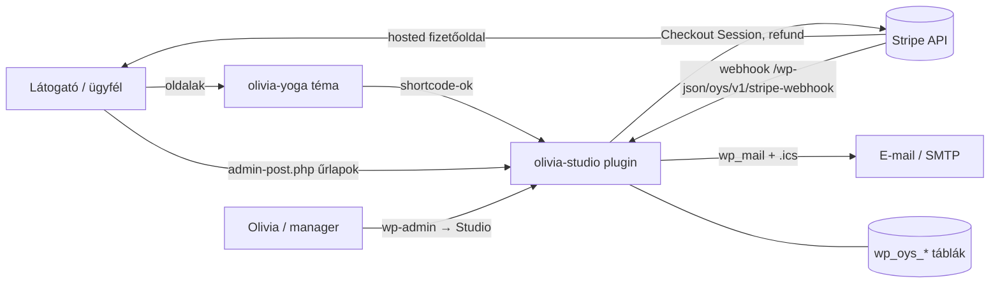
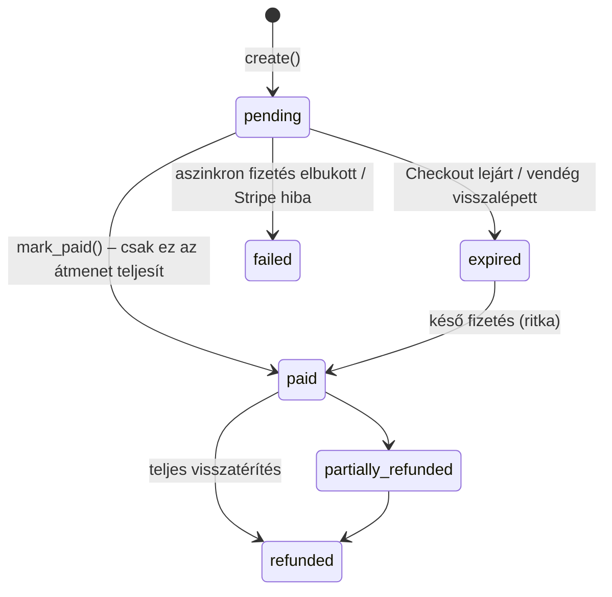
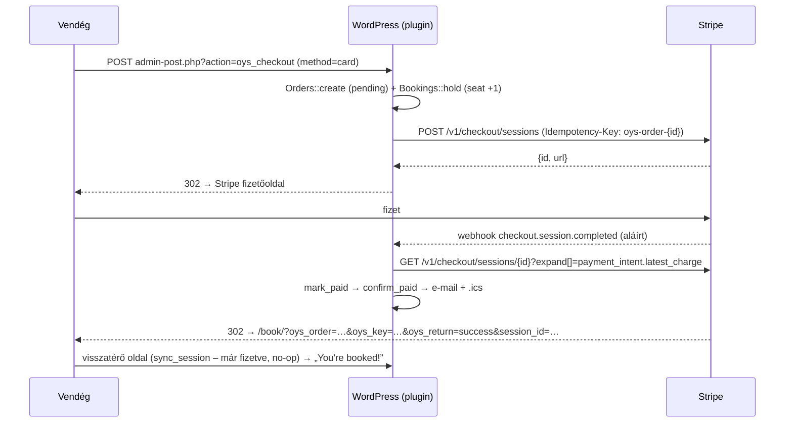
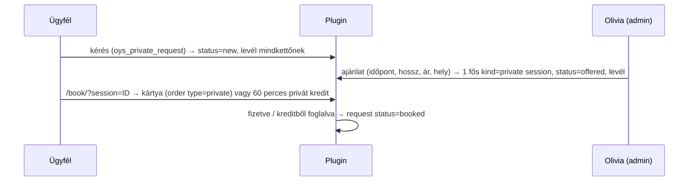

# Fejlesztői dokumentáció – Olivia Kovács Yoga (WordPress)

Ez a dokumentum annak szól, aki a kódot továbbfejleszti vagy üzemelteti. A felhasználói telepítési és élesítési lépések a [README.md](README.md)-ben vannak; itt azt írjuk le, **hogyan működik belülről** és **hogyan kell hozzányúlni**.

Tartalom

1. [Áttekintés](#1-áttekintés)
2. [Repó felépítése](#2-repó-felépítése)
3. [Fejlesztői környezet](#3-fejlesztői-környezet)
4. [Plugin: architektúra](#4-plugin-olivia-studio--architektúra)
5. [Adatmodell](#5-adatmodell)
6. [Folyamatok és állapotgépek](#6-folyamatok-és-állapotgépek)
7. [Stripe integráció](#7-stripe-integráció)
8. [Nyilvános felület: shortcode-ok és űrlapkezelők](#8-nyilvános-felület-shortcode-ok-és-űrlapkezelők)
9. [Admin felület](#9-admin-felület-studio-menü)
10. [Háttérfeladatok (cron)](#10-háttérfeladatok-cron)
11. [E-mailek](#11-e-mailek)
12. [Hookok (bővítési pontok)](#12-hookok-bővítési-pontok)
13. [Téma: olivia-yoga](#13-téma-olivia-yoga)
14. [Statikus előnézet (src/build.py)](#14-statikus-előnézet-srcbuildpy)
15. [Biztonság](#15-biztonság)
16. [Tesztelés](#16-tesztelés)
17. [Kiadás és telepítés](#17-kiadás-és-telepítés)
18. [Gyakori bővítések – receptek](#18-gyakori-bővítések--receptek)
19. [Ismert korlátok, technikai adósság](#19-ismert-korlátok-technikai-adósság)
20. [Konvenciók](#20-konvenciók)

---

## 1. Áttekintés

Két, egymástól elválasztott komponens:

| Komponens | Mappa | Felelősség |
|---|---|---|
| **olivia-studio** (plugin) | `wordpress/olivia-studio/` | Minden üzleti logika: órarend, foglalás, fizetés (Stripe), bérletek, várólista, magánórák, ajándékkártya, ügyfélfiók, e-mailek, admin. |
| **olivia-yoga** (téma) | `wordpress/olivia-yoga/` | Megjelenés és tartalom: sablonok, dizájn (CSS/JS), óratípusok és GYIK tartalomtípus, SEO, tartalombetöltő. |

A téma **nem tartalmaz üzleti logikát**, a plugin **nem tartalmaz dizájnt** (csak a saját felületeihez alap CSS-t, ami a téma CSS-változóit használja). A kettő szűrőkön (filter) keresztül beszél egymással (lásd [12.](#12-hookok-bővítési-pontok)), így a plugin más témával is működik, a téma pedig plugin nélkül is betölt (a foglalási részek helyén üres hely vagy „coming soon” szöveg jelenik meg).

Technológia: WordPress 6.4+ (tesztelve: 6.8.3), PHP 8.1+ (tesztelve: 8.4), MySQL/MariaDB (tesztelve: MariaDB 10.11), Stripe REST API (SDK nélkül). Nincs build lépés, nincs Composer/npm függőség a futáshoz.



---

## 2. Repó felépítése

```
oliv/
├── src/                     Statikus előnézet generátora (Python) – dizájn-referencia
│   ├── build.py
│   ├── content.json         Jóváhagyott szövegek (oldalak, órák, GYIK, cikkek, minta órarend/árak)
│   ├── site.css / site.js   Az „Urban flow” dizájn forrása
│   └── img/                 Fotók 600/1200 px + images.json (alt, fókuszpont)
├── site/                    A generált statikus oldal (19 oldal)
├── preview.html             Egyfájlos előnézet (artifact) – gitignore
├── olivia-kovacs-yoga.html  Letölthető egyfájlos előnézet
├── JEGYZETEK.md             Projekt-jegyzet (állapot, döntések)
└── wordpress/
    ├── README.md            Telepítés, Stripe, élesítési lista (felhasználói)
    ├── DEVELOPER.md         ← ez a fájl
    ├── dist/                Feltölthető ZIP-ek (plugin, téma)
    ├── dev/                 Csak fejlesztéshez: Stripe-szimulátor, levélfogó, router, E2E teszt
    ├── olivia-studio/       Plugin
    │   ├── olivia-studio.php          Belépési pont, include-ok, bootstrap
    │   ├── assets/oys.css             Ügyféloldali felületek stílusa
    │   ├── assets/admin.css           Admin stílus
    │   └── includes/
    │       ├── class-install.php      Táblák (dbDelta), szerepkörök, oldalak létrehozása, verziókezelés
    │       ├── helpers.php            Idő, pénz, URL, flash üzenetek, ikonok
    │       ├── class-settings.php     Beállítások (egy option tömb) + titkos kulcsok
    │       ├── class-products.php     Bérletek/árlista (egy option tömb)
    │       ├── class-schedule.php     Heti sablonok, alkalmak, helyszámlálás
    │       ├── class-passes.php       Bérletek és kreditek
    │       ├── class-bookings.php     Foglalás, tartás, lemondás, jelenlét, várólista
    │       ├── class-orders.php       Rendelések, teljesítés (fulfilment), visszatérítés
    │       ├── class-stripe.php       Stripe API kliens, Checkout, webhook
    │       ├── class-emails.php       Levelek, sablon, .ics
    │       ├── class-customers.php    Regisztráció, belépés, profil, nyilatkozat, wp-admin tiltás
    │       ├── class-privates.php     Magánóra-kérések és ajánlatok
    │       ├── class-gifts.php        Ajándékkártyák
    │       ├── class-cron.php         Háttérfeladatok
    │       ├── class-frontend.php     Shortcode-ok és nyilvános űrlapkezelők
    │       ├── class-privacy.php      WP adatexport / törlés
    │       └── admin/class-admin.php  Studio admin menü és műveletek
    └── olivia-yoga/         Téma
        ├── style.css                  Téma fejléc (a dizájn az assets/site.css-ben)
        ├── functions.php              Setup, assetek, menü, oldalankénti oldalsáv
        ├── header.php / footer.php
        ├── front-page.php             Főoldal
        ├── page.php                   Aloldalak (+ plugin oldalak: book, account, gift-cards)
        ├── single-oy_class.php        Óratípus oldal + az óra következő időpontjai
        ├── home.php / single.php      Napló (blog) lista és cikk
        ├── index.php / 404.php
        ├── template-parts/cards.php   Cikk-kártyák
        ├── inc/helpers.php            Markup segédek (fotó, matrica, futószalag, gomb, oldalfej)
        ├── inc/content-types.php      oy_class, oy_faq CPT + meta boxok + plugin-szűrők
        ├── inc/shortcodes.php         oy_* shortcode-ok, kapcsolati űrlap
        ├── inc/seo.php                Title, meta, OG, JSON-LD
        ├── inc/demo-import.php        Megjelenés → Olivia setup (tartalombetöltő)
        ├── demo/content.json          A betöltő forrása (= src/content.json másolata)
        └── assets/                    site.css (dizájn), wp.css (WP kiegészítések), site.js, img/
```

---

## 3. Fejlesztői környezet

### 3.1 Helyi WordPress PHP beépített szerverrel (így készült és tesztelődött)

Követelmény: PHP 8.1+ (`mysqli`, `curl`, `gd`), MariaDB/MySQL, Node + Playwright (csak az E2E teszthez).

```bash
# 1) Adatbázis
mariadb -uroot -e "CREATE DATABASE oywp CHARACTER SET utf8mb4;
  CREATE USER 'oy'@'127.0.0.1' IDENTIFIED BY 'oy'; GRANT ALL ON oywp.* TO 'oy'@'127.0.0.1';"

# 2) WordPress (bármilyen forrásból; pl. git)
git clone --depth 1 -b 6.8.3 https://github.com/WordPress/WordPress.git wp && cd wp

# 3) Téma, plugin, levélfogó symlinkkel (így a repóban szerkesztesz)
ln -s /UT/oliv/wordpress/olivia-studio wp-content/plugins/olivia-studio
ln -s /UT/oliv/wordpress/olivia-yoga   wp-content/themes/olivia-yoga
mkdir -p wp-content/mu-plugins && ln -s /UT/oliv/wordpress/dev/mu-plugins/dev-mail-catcher.php wp-content/mu-plugins/
cp /UT/oliv/wordpress/dev/router.php .
```

`wp-config.php` (a lényeges sorok):

```php
define( 'DB_NAME', 'oywp' ); define( 'DB_USER', 'oy' ); define( 'DB_PASSWORD', 'oy' ); define( 'DB_HOST', '127.0.0.1' );
define( 'WP_DEBUG', true ); define( 'WP_DEBUG_LOG', true ); define( 'WP_DEBUG_DISPLAY', false );
define( 'WP_HOME', 'http://127.0.0.1:8080' ); define( 'WP_SITEURL', 'http://127.0.0.1:8080' );
define( 'OYS_STRIPE_API_BASE', 'http://127.0.0.1:8090' );   // Stripe-szimulátor (CSAK helyben!)
define( 'DISABLE_WP_CRON', true );                           // cront kézzel futtatjuk (lásd 10.)
```

```bash
# 4) Szerverek (a WORKERS kell: a webhook és a Stripe-hívás egymásra vár, egy szálon holtpont lenne)
PHP_CLI_SERVER_WORKERS=4 php -S 127.0.0.1:8080 router.php                                  # WordPress
PHP_CLI_SERVER_WORKERS=4 php -S 127.0.0.1:8090 /UT/oliv/wordpress/dev/mock-stripe.php      # Stripe mock
```

5. Böngészőben: telepítés (`/wp-admin/install.php`), időzóna **America/New_York**, közvetlen hivatkozások: **Bejegyzés neve**.
6. Bővítmények → **Olivia Studio** bekapcsolása, Megjelenés → **Olivia Yoga** bekapcsolása.
7. Megjelenés → **Olivia setup** → „Set up the site content”.
8. Studio → Settings: Test secret key = `sk_test_mock`, Test webhook secret = `whsec_mock`.

A levelek küldés helyett a `wp-content/mail-log/` mappába kerülnek (HTML + .ics melléklet).

### 3.2 Hasznos parancsok

```bash
# PHP szintaxis-ellenőrzés az egész kódra
find wordpress -name '*.php' -exec php -l {} \; | grep -v "No syntax errors"

# Cron kézi futtatása (holdok lejárata, emlékeztetők, alkalmak generálása)
php -r 'require "wp-load.php"; OYS_Cron::frequent(); OYS_Cron::hourly();'

# Helyszámlálók újraszámolása egy alkalomra (ha kézzel nyúltál az adatbázishoz)
php -r 'require "wp-load.php"; echo OYS_Schedule::recount(123);'
```

### 3.3 Valódi Stripe teszt-móddal (élesítés előtt kötelező)

Távolítsd el az `OYS_STRIPE_API_BASE` sort, a Settingsbe tedd a saját `sk_test_…` kulcsot. A webhookhoz helyben a Stripe CLI kell:

```bash
stripe listen --forward-to http://127.0.0.1:8080/wp-json/oys/v1/stripe-webhook
# a kiírt whsec_… kerül a "Test webhook signing secret" mezőbe
```

Tesztkártyák: `4242 4242 4242 4242` (sikeres), `4000 0000 0000 9995` (elutasított), `4000 0025 0000 3155` (3D Secure).

---

## 4. Plugin (olivia-studio) – architektúra

- **Osztályok statikus metódusokkal** (`OYS_*`), egy felelősség / fájl. Nincs autoloader: az `olivia-studio.php` include-ol mindent a megfelelő sorrendben.
- **Bootstrap** (`plugins_loaded`): `OYS_Install::maybe_upgrade()` → `init()` a Customers, Stripe, Cron, Frontend, Privacy (és adminban az Admin) osztályokon. A `class-bookings.php`, `class-privates.php`, `class-gifts.php` a fájl végén maga hívja az `init()`-et.
- **Aktiválás**: táblák (`dbDelta`), szerepkörök, alap beállítások és bérletek, oldalak (Book / My account / Gift cards), cron ütemezés.
- **Verziókezelés**: `OYS_DB_VERSION` konstans + `oys_db_version` option. Ha eltér, a `maybe_upgrade()` újrafuttatja az aktiválást (a `dbDelta` csak hozzáad/módosít oszlopot, adatot nem töröl). **Sémaváltozásnál ezt a konstanst emeld.**
- **Időkezelés**: minden dátum **UTC-ben** tárolódik (`Y-m-d H:i:s`), megjelenítéskor a WP időzónájára vált (`oys_date()`, `oys_time()` → `wp_date`). Adminban beírt helyi időből `oys_local_to_utc()` készít UTC-t. A heti sablonok helyi időben értendők, így a nyári/téli időszámítás váltása nem tolja el az órákat.
- **Pénz**: mindig egész **cent** (`*_cents`), pénznem kisbetűs ISO (`usd`). Kiírás: `oys_money()`, beolvasás: `oys_cents_from_input()`.
- **Konfiguráció** két option tömbben: `oys_settings` (lásd `OYS_Settings::defaults()`) és `oys_products`. Oldal-hozzárendelés: `oys_page_book`, `oys_page_account`, `oys_page_gifts`.
- **Jogosultság**: új capability **`oys_manage`** (adminisztrátor + „Studio manager” szerepkör). Ügyfelek: **`oys_customer`** szerepkör (csak `read`), nem látják a wp-admint (átirányítás a fiókra) és az admin sávot.
- **Flash üzenetek**: `oys_flash()` → transient (bejelentkezve felhasználónként, egyébként egy `oys_fk` sütihez kötve), kiírás: `oys_render_flash()`.

---

## 5. Adatmodell

Minden tábla prefixe `{$wpdb->prefix}oys_` (a kódban: `OYS_Install::table( 'bookings' )`). Datetime = UTC.

### 5.1 Táblák

**`templates`** – heti ismétlődő óra (ebből generálódnak az alkalmak)

| Oszlop | Jelentés |
|---|---|
| `class_slug` | Óratípus (a téma `oy_class` posztjának slugja) |
| `weekday` | 1 = hétfő … 7 = vasárnap (ISO-8601) |
| `start_time` | `HH:MM`, **helyi idő** |
| `duration_min`, `capacity`, `price_cents` | hossz, férőhely, drop-in ár |
| `location`, `online_url`, `note` | hely, online link (csak foglalóknak látszik), rövid megjegyzés |
| `active` | 0 = nem generál új alkalmat |

**`sessions`** – egy konkrét, foglalható alkalom

| Oszlop | Jelentés |
|---|---|
| `kind` | `group` (csoportos óra) · `event` (esemény/workshop) · `private` (magánóra) |
| `class_slug`, `title`, `description` | ha `title` üres, a név a `class_slug`-ból jön (`oys_session_title()`) |
| `starts_at`, `ends_at` | UTC |
| `capacity`, **`booked`** | `booked` = megerősített foglalások + **le nem járt** fizetési tartások. **Denormalizált számláló**, atomikusan módosul (lásd 6.1). |
| `price_cents` | drop-in ár; 0 = ingyenes |
| `credits_allowed` | 1 = bérletből foglalható |
| `status` | `scheduled` · `cancelled` |
| `template_id` | honnan generálódott (0 = egyedi). A generálás a (`template_id`, `starts_at`) páros alapján hagyja ki a már létezőt (indexelt, de nem UNIQUE) |

**`bookings`**

| Oszlop | Jelentés |
|---|---|
| `status` | lásd 6.2 állapotgép |
| `paid_with` | `credit` · `card` · `free` · `admin` · `cash` · `comp` |
| `pass_id` | melyik bérletből vont le kreditet (lemondáskor ide jár vissza) |
| `order_id` | kártyás fizetés rendelése |
| `hold_expires` | fizetés alatti tartás lejárata (csak `pending`) |
| `reminder_sent`, `checked_in_at`, `cancelled_at`, `note` | |

**`waitlist`** – (`session_id`, `user_id`) egyedi; `notified_at` = kapott-e „felszabadult hely” levelet.

**`passes`** – bérletek és kreditek

| Oszlop | Jelentés |
|---|---|
| `kind` | `class` (csoportos óra / esemény) · `private` (60 perces magánóra) |
| `credits_total`, `credits_left` | |
| `expires_at` | NULL = nem jár le |
| `source` | `purchase` · `gift` · `admin` · `cancel` (lemondott drop-in helyett) · `refund` (lejárt bérletre visszajáró kredit) |
| `product_id`, `order_id`, `name` | eredet |

**`orders`** – minden kártyás fizetés

| Oszlop | Jelentés |
|---|---|
| `type` | `dropin` · `pack` (bérlet, opcionálisan egy óra lefoglalásával) · `gift` · `private` |
| `status` | lásd 6.3 |
| `amount_cents`, `currency` | a szerver számolja, a kliens nem befolyásolja |
| `stripe_session_id` (UNIQUE), `stripe_payment_intent`, `receipt_url` | |
| `session_id`, `booking_id`, `product_id` | kapcsolt entitások |
| `meta` (JSON) | pl. `recipient_name/email/message` (gift), `request_id` (private), `refunded_cents` |

**`gift_cards`** – `code` (UNIQUE, formátum `OY-XXXX-XXXX`, nem félreolvasható karakterekkel), `product_id`, `status` (`active` · `redeemed` · `void`), vásárló, címzett, beváltó.

**`private_requests`** – `status` (`new` · `offered` · `booked` · `declined` · `cancelled`), igények (`duration_min`, `people`, `location_type`, `address`, `preferred`, `notes`), ajánlat (`session_id`, `price_cents`, `admin_message`), `order_id`.

**`stripe_events`** – feldolgozott webhook esemény-azonosítók (idempotencia).

### 5.2 Egyéb tárolt adatok

| Hol | Kulcs | Mit |
|---|---|---|
| option | `oys_settings`, `oys_products`, `oys_db_version`, `oys_page_{book,account,gifts}` | konfiguráció |
| user meta | `oys_phone`, `oys_area`, `oys_emergency_name`, `oys_emergency_phone`, `oys_health_notes`, `oys_marketing` | profil (`OYS_Customers::PROFILE_FIELDS`) |
| user meta | `oys_waiver_version`, `oys_waiver_at`, `oys_waiver_ip` | nyilatkozat elfogadása |
| user meta | `oys_stripe_customer_test`, `oys_stripe_customer_live` | Stripe customer ID módonként |
| post meta (`oy_class`) | `oy_duration`, `oy_level`, `oy_intensity` (1–3), `oy_link`, `oy_aside_photo`, `oy_seo_title` | téma |
| post meta (oldal) | `oy_seo_title`, `oy_seo_desc` | téma SEO |
| post meta (`oy_faq`) | `oy_home` | főoldalon megjelenik-e |
| attachment meta | `oy_key`, `oy_pos` | importált fotó kulcsa, fókuszpont (`object-position`) |

### 5.3 Termékek (`oys_products`)

`id => [ name, kind, credits, validity_days, price_cents, description, features, featured, giftable, active, duration_min, sort ]`

| `kind` | Jelentés | Credit fajta |
|---|---|---|
| `pack` | csoportos bérlet | `class` |
| `intro` | bevezető ajánlat – csak `OYS_Orders::is_new_customer()` esetén vehető (alapból inaktív) | `class` |
| `private_pack` | magánóra-csomag | `private` |
| `private_single` | egy magánóra ára adott hosszra – árlista és ajándék (ajándékként 1 privát kredit) | `private` |

A drop-in ár nem termék: az alkalom (`sessions.price_cents`) vagy a sablon adja.

---

## 6. Folyamatok és állapotgépek

### 6.1 Helyfoglalás – versenyhelyzet-mentes számláló

```sql
UPDATE wp_oys_sessions SET booked = booked + 1
 WHERE id = %d AND status = 'scheduled' AND booked < capacity
```

Ha az érintett sorok száma 1, a hely a miénk (`OYS_Schedule::take_seat()`); különben telt ház. Felszabadítás: `release_seat()` (`booked - 1`, soha nem megy 0 alá), ami kiváltja az `oys_seat_released` actiont → várólista-feldolgozás. Ha a számláló elcsúszna (kézi DB-szerkesztés), az `OYS_Schedule::recount()` a foglalásokból újraszámolja; az admin névsor oldal megnyitáskor ezt meg is teszi.

**Fontos:** foglalást **mindig** az `OYS_Bookings` metódusain keresztül hozz létre vagy törölj, különben a számláló elcsúszik.

### 6.2 Foglalás állapotai


- **Tartás** (`hold`): `hold_minutes` (min. 30) **+ 5 perc** – mindig tovább él, mint a Stripe Checkout Session, ami lejárat után már nem fizethető.
- Ha a fizetés **a tartás lejárta után** érkezik (pl. késő aszinkron fizetés), a `confirm_paid()` újra helyet kér; ha nincs, akkor is megerősíti (a vendég fizetett), a számlálót túltolja, és e-mailben szól a stúdiónak.
- **Lemondás szabálya** (`cancel()`):

| Ki / mikor | `paid_with = credit` | `paid_with = card` | egyéb |
|---|---|---|---|
| Ügyfél, határidőn belül (`cancel_hours`, magánóránál `private_cancel_hours`) | kredit vissza ugyanarra a bérletre (ha a bérlet ≤ 1 napon belül lejár vagy lejárt: új 1 kredites, 30 napos) → `returned` | új 1 kredites bérlet (`dropin_credit_days`) → `credit` | `none` |
| Ügyfél, határidő után | nincs visszatérítés → `late` | → `late` | → `late` |
| Stúdió (`by_studio`) | mindig mint „határidőn belül” | | |

  A pénz visszautalása sosem automatikus lemondáskor; arra az admin „Refund” gombja szolgál.

### 6.3 Rendelés és teljesítés



**Pontosan egyszeri teljesítés.** A `mark_paid()`:

```sql
UPDATE wp_oys_orders SET status='paid', paid_at=%s
 WHERE id=%d AND status IN ('pending','expired','failed')
```

Csak az a hívás teljesít (`fulfil()`), amelyik ezt az UPDATE-et megnyerte. Két forrás indíthatja, és bármilyen sorrendben, akár párhuzamosan érkezhetnek:

1. **Webhook** (`checkout.session.completed` / `async_payment_succeeded`),
2. **Visszatérő oldal** (`template_redirect` → `OYS_Frontend::return_from_stripe()` → `OYS_Stripe::sync_session()`), ha a vendég hamarabb ér vissza, mint a webhook.

`fulfil()` típusonként:

| `type` | Teendő |
|---|---|
| `dropin` | `OYS_Bookings::confirm_paid( booking_id )` |
| `private` | ugyanez + `OYS_Privates::mark_paid( request_id )` |
| `pack` | bérlet jóváírása (`grant_product`) + levél; ha van `booking_id` („vedd meg és foglald le”): 1 kredit levonása az új bérletből, a foglalás `paid_with=credit` lesz (így lemondáskor a kredit a bérletre jár vissza) |
| `gift` | ajándékkód létrehozása, levél a címzettnek és a vásárlónak |

Utána: admin értesítő levél + `oys_order_paid` action.

**Visszatérítés** (`mark_refunded`): részleges esetén csak státusz és `meta.refunded_cents`. Teljesnél ráadásul: jövőbeli megerősített foglalás törlése (hely felszabadul), a rendeléssel vett bérlet maradék kreditjeinek nullázása, aktív ajándékkód érvénytelenítése.

### 6.4 Tipikus foglalás kártyával (időrend)



Megszakítás („Back” a Stripe oldalon): a visszatérő oldal lejáratja a Checkout Sessiont a Stripe-nál (`/expire`), a rendelés `expired`, a hely azonnal felszabadul.

### 6.5 Várólista

`process_waitlist( session_id )` fut minden hely-felszabaduláskor (`oys_seat_released`), ha az óra kezdete előtt még több mint `waitlist_cutoff_hours` van:

1. Sorban végigmegy a várólistán, amíg van szabad hely.
2. Akinek van érvényes kreditje (és az alkalom engedi a bérletet) → **automatikusan lefoglalja** (`book_with_credit`), „You're in” levél.
3. Akinek nincs → egyszeri „A spot opened” levél (`notified_at`), aki előbb foglal, azé.

### 6.6 Magánóra



- A privát alkalmat **csak a kérő ügyfél** láthatja és foglalhatja (`OYS_Privates::may_book()`); bejelentkezés nélkül a foglaló oldal nem mutat semmit (a helyszín lehet az ügyfél lakcíme).
- Privát kredit csak **60 perces** alkalomra használható (`credits_allowed` = 1 csak 60 percnél).

### 6.7 Ajándékkártya

Vásárlás (`oys_gift_buy`, bejelentkezés kell) → `gift` rendelés → fizetés után kód → címzett e-mail. Beváltás (`oys_gift_redeem`): feltételes UPDATE `active → redeemed` (kétszer nem váltható be), majd `grant_product(…, 'gift')`.

---

## 7. Stripe integráció

- **Stripe Checkout** (hosted), `mode=payment`, dinamikus fizetési módok (a Stripe dashboardon kapcsolhatók). SDK nincs: `OYS_Stripe::request()` = `wp_remote_request` + form-encoded body, `Stripe-Version: 2024-06-20`.
- **API alap-URL** felülírható: `OYS_STRIPE_API_BASE` (csak teszthez!).
- **Kulcsok**: Settings oldal vagy `wp-config.php` konstansok, amelyek elsőbbséget élveznek: `OYS_STRIPE_SECRET_KEY`, `OYS_STRIPE_WEBHOOK_SECRET`. Élesben a konstans ajánlott (nem kerül adatbázis-mentésbe). Korlátozott kulcs (restricted key) esetén szükséges jogok: Checkout Sessions (write), Customers (write), Refunds (write), PaymentIntents / Charges (read).
- **Idempotencia a kimenő hívásokon**: `Idempotency-Key` = `oys-order-{id}`, `oys-customer-{user}-{mode}`, `oys-refund-{order}-{amount}`.
- **Customer**: felhasználónként egy (`oys_stripe_customer_{test|live}` user meta), így a nyugták és a Stripe-os ügyféladatok egy helyen vannak.
- **Checkout paraméterek**: `client_reference_id` = order id, `metadata.order_id`, `expires_at` = most + `hold_minutes` (Stripe minimuma 30 perc), `success_url` a `{CHECKOUT_SESSION_ID}` helyőrzővel és egy HMAC kulccsal (`OYS_Stripe::order_key()`), hogy a visszatérő oldal ne legyen kitalálható.
- **Webhook**: `POST /wp-json/oys/v1/stripe-webhook`
  1. Aláírás ellenőrzés: `Stripe-Signature: t=…,v1=…`, `HMAC-SHA256(secret, "{t}.{payload}")`, `hash_equals`, **5 perc** tolerancia → hibánál `400`.
  2. Idempotencia: `INSERT IGNORE` az `stripe_events` táblába; ha már volt → `200 duplicate`.
  3. Feldolgozás; kivétel esetén az eseményt törli a táblából és `500`-at ad, hogy a Stripe újrapróbálja.

| Esemény | Teendő |
|---|---|
| `checkout.session.completed` (ha `payment_status=paid`) | `sync_session()` (nyugta-link miatt újraolvassa), hiba esetén az esemény adataiból teljesít |
| `checkout.session.async_payment_succeeded` | ugyanez |
| `checkout.session.async_payment_failed` | rendelés `failed`, hely felszabadul |
| `checkout.session.expired` | rendelés `expired`, hely felszabadul |
| `charge.refunded` | `mark_refunded( amount_refunded )` – a Stripe dashboardon indított visszatérítést is átveszi |

---

## 8. Nyilvános felület: shortcode-ok és űrlapkezelők

### 8.1 Plugin shortcode-ok

| Shortcode | Attribútumok | Hol |
|---|---|---|
| `[oys_schedule]` | `days` (14), `kind` (`group,event`), `class` (slug), `empty_days` (`yes`/`no`) | Schedule & pricing, főoldal, óratípus oldal |
| `[oys_events]` | – | Events oldal, főoldal |
| `[oys_pricing]` | – | Schedule & pricing, főoldal |
| `[oys_book]` | – (URL paraméterek: `session`, `product`, `oys_order`+`oys_key`+`oys_return`) | Book oldal |
| `[oys_account]` | – (`tab` = `bookings` · `passes` · `private` · `history` · `payments` · `profile`) | My account oldal |
| `[oys_gift_cards]` | – | Gift cards oldal |
| `[oys_private_request]` | – | Private yoga oldal |

### 8.2 Űrlapkezelők (`admin-post.php`, mind noncé-val)

| `action` | Kinek | Mit csinál |
|---|---|---|
| `oys_register` | vendég | fiók létrehozása + nyilatkozat + belépés + üdvözlő levél |
| `oys_login` | vendég | `wp_signon` |
| `oys_checkout` | belépett | foglalás: `method` = `credit` · `card` · `free` · `pack:{product_id}` |
| `oys_buy` | belépett | bérlet vásárlás foglalás nélkül |
| `oys_cancel` | belépett, saját foglalás | lemondás |
| `oys_waitlist` | belépett | `do` = `join` / `leave` |
| `oys_ics` | belépett, saját foglalás (vagy manager) | .ics letöltés (GET, nonce a linkben) |
| `oys_profile`, `oys_waiver` | belépett | profil, jelszó, nyilatkozat |
| `oys_private_request` | belépett | magánóra-kérés |
| `oys_gift_buy`, `oys_gift_redeem` | belépett | ajándékkártya |

A `nopriv_` változatok vendégnél visszairányítanak (a checkout és a buy csak belépve működik). Minden kezelő a végén `wp_safe_redirect`-tel tér vissza (PRG minta), az üzenet flash-ben megy.

### 8.3 Téma shortcode-ok (a jóváhagyott oldalszövegekben)

`[oy_classes]`, `[oy_faq]`, `[oy_areas]`, `[oy_breath]`, `[oy_contact_form]`, `[oy_booking_link label=""]`, `[oy_private_link]`, `[oy_gift_link]`, `[oy_button url="" label=""]`, valamint az átirányítók: `[oy_schedule]` → `[oys_schedule]`, `[oy_pricing]` → `[oys_pricing]`, `[oy_events]` → `[oys_events]`. A kapcsolati űrlap (`oy_contact`) a `notify_email` címre küld.

---

## 9. Admin felület (Studio menü)

`OYS_Admin` – minden oldal `oys_manage` jogot kér. Minden művelet egy helyen fut át:

```
admin-post.php?action=oys_admin_{művelet}  →  OYS_Admin::guard()  →  current_user_can( 'oys_manage' ) + check_admin_referer  →  do_{művelet}()
```

Új admin művelet felvétele: add hozzá a nevét az `init()`-ben lévő `$actions` tömbhöz, írj egy `private static function do_{név}()` metódust, és az űrlapot `self::form( '{név}' )` nyissa (ez teszi bele a noncét).

| Oldal (`page=`) | Tartalom |
|---|---|
| `oys` | Ma: KPI-k (30 napos bevétel, 7 napos telítettség, új kérések, ügyfelek), mai névsorok, 7 napos lista |
| `oys-schedule` | Alkalmak listája (upcoming/past); `&edit=ID` szerkesztés/új (0), lemondás; `&session=ID` névsor, jelenlét, hozzáadás, várólista |
| `oys-templates` | Heti sablonok soronkénti mentése (HTML `form=` attribútummal), „Create upcoming dates now” |
| `oys-private` | Kérések; `&request=ID` ajánlat / elutasítás |
| `oys-customers` | Keresés; `&user=ID` profil, bérletek (módosítás, kredit adás), foglalások, fizetések |
| `oys-orders` | Szűrés státuszra, nyugta, részleges/teljes visszatérítés |
| `oys-gifts`, `oys-products`, `oys-settings` | ajándékkártyák, árak/bérletek, beállítások |

---

## 10. Háttérfeladatok (cron)

| Hook | Ütem | Feladat |
|---|---|---|
| `oys_frequent` | 5 perc (`oys_5min`) | `OYS_Bookings::expire_holds()` – lejárt tartások felszabadítása · `OYS_Cron::send_reminders()` – emlékeztetők |
| `oys_hourly` | óránként | `OYS_Schedule::generate()` – alkalmak létrehozása `weeks_ahead` hétre előre |

- A generálás **idempotens** (`template_id` + `starts_at` alapján kihagyja a meglévőt), bármikor futtatható.
- Emlékeztető csak olyan foglalásra megy, amely az emlékeztető-ablak megnyílta **előtt** jött létre (aki 3 órával előtte foglal, a visszaigazolást kapja, emlékeztetőt nem), és csak egyszer (`reminder_sent`).
- Élesben **valódi cron** ajánlott (`DISABLE_WP_CRON` + 5 percenkénti `wp-cron.php` hívás), különben forgalom nélkül nem futnak a feladatok.

---

## 11. E-mailek

`OYS_Emails::send( $to, $subject, $heading, $body_html, $attachments, $cta )` – egységes HTML keret (táblázatos, inline stílus, e-mail kliens-barát), opcionális gomb. A `.ics` fájlok ideiglenesen a `uploads/oys-tmp/` mappába kerülnek és küldés után törlődnek.

| Metódus | Mikor |
|---|---|
| `booking_confirmed` (+ .ics) | minden megerősített foglalás |
| `booking_cancelled` | lemondás (ügyfél vagy stúdió), stúdiónak is szól ha az ügyfél mondta le |
| `waitlist_promoted` (+ .ics), `waitlist_spot_open` | várólista |
| `reminder` | `reminder_hours` órával előtte |
| `pass_purchased`, `gift_card`, `gift_receipt` | vásárlások |
| `welcome` | regisztráció |
| `private_request_received`, `private_offer` | magánóra |
| `admin_new_order`, `admin_notice` | stúdiónak (`notify_email`) |

Feladó: `email_from_name` / `email_from` beállítás. Élesben SMTP / tranzakciós szolgáltató kell (README).

---

## 12. Hookok (bővítési pontok)

### Actionök

| Hook | Paraméterek | Mikor |
|---|---|---|
| `oys_booking_confirmed` | `$booking_id` | foglalás megerősítve (kredit, kártya, kézi, várólista) |
| `oys_booking_cancelled` | `$booking_id`, `$outcome` (`returned`/`credit`/`late`/`none`) | lemondás |
| `oys_order_paid` | `$order_id` | rendelés teljesítve (egyszer) |
| `oys_seat_released` | `$session_id` | hely felszabadult (belül: várólista) |
| `oys_email_sent` | `$to`, `$subject`, `$html` | minden kimenő levél után (naplózáshoz, CRM-hez) |

### Filterek

| Filter | Alapérték | Ki használja |
|---|---|---|
| `oys_class_titles` | `[]` | a téma tölti fel `slug => cím` párokkal az `oy_class` posztokból |
| `oys_class_url` | `''`, `$slug` | a téma adja az óratípus oldal URL-jét |
| `oys_corporate_contact_url` | `/contact/?topic=corporate#book` | árkártya „Request a proposal” |
| `oys_featured_badge` | „Most popular” címke | a téma forgó matricára cseréli |
| `oys_dropin_display_price` | `2500` | az árkártyán mutatott drop-in ár (a valódi ár alkalmanként az adatbázisból jön) |

Példa – új foglalás Slackre / CRM-be:

```php
add_action( 'oys_booking_confirmed', function ( $booking_id ) {
	$b = OYS_Bookings::get( $booking_id );
	$s = OYS_Schedule::get( $b->session_id );
	wp_remote_post( SLACK_WEBHOOK_URL, array( 'body' => wp_json_encode( array(
		'text' => get_userdata( $b->user_id )->display_name . ' → ' . oys_session_title( $s ) . ' ' . oys_date( $s->starts_at ),
	) ) ) );
} );
```

---

## 13. Téma: olivia-yoga

### 13.1 Sablon-hierarchia

| Nézet | Fájl | Megjegyzés |
|---|---|---|
| Főoldal | `front-page.php` | a szekciók szövegei a sablonban; a „Meet your teacher” rész a Home oldal tartalma |
| Oldalak | `page.php` | színes oldalfej (szín a slugból: `oy_accent_for()`), kiemelt kép, oldalsáv `oy_page_aside( $slug )` szerint; a plugin oldalain (book, account) nincs fotó és oldalsáv, a tartalom teljes szélességű (`layout--studio`) |
| Óratípus | `single-oy_class.php` | részletek, a következő 21 nap időpontjai, oldalsáv, többi óra. Ha az `oy_link` ki van töltve, 301 a megadott oldalra |
| Napló | `home.php`, `single.php` | kártyák, olvasási idő, szerzői doboz |

### 13.2 Tartalomtípusok

- **`oy_class`** (Óratípusok, `/yoga-classes/{slug}/`): cím, kivonat (a listában a leírás), tartalom, kiemelt kép, sorrend (`menu_order`), meta box: hossz, szint, intenzitás, „link oldalra”, SEO cím. **A slug a kulcs**, amit a plugin sablonjai és alkalmai (`class_slug`) használnak – ne nevezd át, ha már van hozzá órarend.
- **`oy_faq`** (GYIK): kérdés = cím, válasz = tartalom, „főoldalon” jelölő, sorrend.

### 13.3 Dizájn és CSS

- `assets/site.css` – az „Urban flow” dizájn (azonos a `src/site.css`-sel; **a forrás a `src/site.css`**, módosítás után másold át, vagy fordítva – tartsd szinkronban).
- `assets/wp.css` – csak WordPress-specifikus kiegészítések (szerkesztői tartalom szélessége, WP menü, admin sáv, lapozás).
- `olivia-studio/assets/oys.css` – a plugin felületei; színeit `--oys-*` változókból veszi, amelyek a téma tokenjeire mutatnak, fallback értékekkel.
- Színtokenek (`:root`): `--forest #2B5036`, `--moss #1B3324`, `--fern`, `--sage`, `--pale`, `--paper`, `--ink`, `--lilac #C6A3EE`, `--pink #FF72B6`, `--orchid #D92B86` (fehér szöveggel is olvasható), `--sun #FF8C42`. Betűk: Anton (címek), Archivo (szöveg, `wdth` tengely a címkékhez).
- Színrotáció: `OY_ACCENTS = [lilac, pink, sun, sage]` (téma) és ugyanez a plugin kártyáin.

### 13.4 Segédfüggvények (`inc/helpers.php`)

`oy_photo( $key_or_attachment_id, $sizes, $eager, $alt )` (theme-kép kulcs → srcset 600/1200; szám → médiatár), `oy_post_photo()`, `oy_icon()`, `oy_btn()`, `oy_sticker()`, `oy_marquee()`, `oy_badge()`, `oy_kicker()`, `oy_section_head()`, `oy_page_head()`, `oy_crumbs()`, `oy_intensity()`, URL-ek: `oy_page_link()`, `oy_book_url()`, `oy_private_url()`, `oy_account_url()`, `oy_contact_url()`, és `oy_resolve_tokens()` (a `content.json` `{{page:…}}`, `{{class:…}}`, `{{contact:…}}`, `{{private}}` tokenjei).

### 13.5 Tartalombetöltő (`inc/demo-import.php`)

Megjelenés → Olivia setup. Sorrend: óratípusok → oldalak (tokenek feloldásával, kiemelt képpel, SEO metával) → óratípus-szövegek → GYIK → cikkek → „Main” menü → (ha aktív a plugin) heti sablonok + alkalmak + minta esemény. **Slug alapján idempotens**: meglévőt nem ír felül. A képeket egyszer importálja a médiatárba (`oy_key` meta alapján). Csak a `hello-world` slugú 1-es posztot törli.

### 13.6 SEO (`inc/seo.php`)

Document title (`oy_seo_title` meta), meta description (`oy_seo_desc` vagy kivonat), Open Graph, és JSON-LD `@graph`: WebSite, LocalBusiness + HealthAndBeautyBusiness, Person (Olivia, végzettséggel), FAQPage (GYIK oldalon), BlogPosting (cikkeken). A book / account oldal `noindex`. **Ha Yoast, Rank Math, SEOPress vagy AIOSEO aktív, a téma nem ír ki semmit** (`oy_seo_plugin_active()`).

---

## 14. Statikus előnézet (src/build.py)

A WordPress előtti dizájn-prototípus, ma dizájn-referenciaként és gyors előnézetként használjuk.

```bash
pip install pillow
cd src && python3 build.py
# → ../site/ (többoldalas statikus oldal), ../preview.html (artifact), ../olivia-kovacs-yoga.html (letölthető)
```

A tartalom (`content.json`) és a CSS közös a témával: ha itt módosul a szöveg, a `wordpress/olivia-yoga/demo/content.json`-t is frissíteni kell (a betöltő onnan dolgozik), és egy már feltöltött oldalon a szöveget a WordPressben kell átírni.

---

## 15. Biztonság

- **CSRF**: minden űrlap `wp_nonce_field` + `check_admin_referer`; az .ics link nonce-os.
- **Jogosultság**: admin műveletek `oys_manage`; ügyféloldali műveletek tulajdonjogot ellenőriznek (saját foglalás, saját privát alkalom).
- **SQL**: `$wpdb->prepare`, státuszlisták `esc_sql`-lel; a felhasználói bemenet sosem kerül nyersen lekérdezésbe.
- **Kimenet**: `esc_html` / `esc_attr` / `esc_url` / `wp_kses_post`.
- **Összegek**: kizárólag szerveroldalról (alkalom / termék ára); a kliens csak választ (`method`), nem küld árat.
- **Webhook**: aláírás + időbélyeg tolerancia + idempotencia; hamis kérés → 400.
- **Visszatérő oldal**: HMAC kulcs az order ID mellett (`order_key()`), nem kitalálható.
- **Adatvédelem**: egészségügyi megjegyzés csak a stúdiónak látszik; WP adatexport/törlés bekötve (a fizetési és foglalási adatok könyvelés miatt maradnak, a profil- és egészségügyi adatok törlődnek).
- **Regisztráció**: honeypot mező. Brute-force / rate limit **nincs** a pluginban → élesben biztonsági bővítmény (pl. Wordfence, Limit Login Attempts) kell.
- **Titkok**: Stripe kulcsokat élesben `wp-config.php` konstansban tartsd.

---

## 16. Tesztelés

### 16.1 Végpont-teszt (Playwright)

`wordpress/dev/e2e.js` – valódi böngészővel végigkattintja a folyamatokat a helyi WordPress + Stripe-szimulátor ellen, és közben az adatbázist ellenőrzi (`php` hívásokkal a `WP_DIR`-ben).

```bash
npm i -g playwright   # ha nincs; a böngészőt a playwright telepíti
WP_DIR=/ut/a/wordpress SHOTS=/tmp/oys-shots node wordpress/dev/e2e.js
```

30 ellenőrzés: vendég regisztráció a foglaló oldalon · hely tartása fizetés alatt · kártyás foglalás, nyugta, levél, .ics · bérlet vásárlás · foglalás kreditből · lemondás határidőn belül, kredit vissza · telt ház → várólista → lemondás → automatikus beléptetés + levél · magánóra kérés → ajánlat → fizetés, a cím nem látszik másnak · ajándékkártya vásárlás, beváltás, második beváltás tiltva · visszatérés a webhook előtt · késő webhook nem teljesít kétszer · megszakított fizetés felszabadítja a helyet · teljes visszatérítés törli a foglalást · hamis webhook 400. Futásonként új felhasználókat és üres alkalmakat használ, többször is futtatható. Képernyőképeket ment a `SHOTS` mappába.

### 16.2 Stripe-szimulátor (`dev/mock-stripe.php`)

Implementálja: `POST /v1/customers`, `POST /v1/checkout/sessions`, `GET /v1/checkout/sessions/{id}` (`expand[]=payment_intent.latest_charge`), `POST …/{id}/expire`, `POST /v1/refunds`, egy hamis fizetőoldalt (`/pay/{id}`: „Pay”, „Pay (webhook delayed)”, „Back / cancel”) aláírt webhookkal, és egy teszt-segédet (`/_webhook?type=…&id=…`) esemény újraküldéséhez. Állapot: `sys_get_temp_dir()/mock-stripe.json`, webhook napló: `…/mock-stripe-webhooks.log`. **Élesre soha nem kerül.**

### 16.3 Ami még nincs

PHPUnit egységtesztek (a `WP_UnitTestCase` keretrendszerrel érdemes a `OYS_Bookings::cancel`, `OYS_Passes::consume/refund_credit`, `OYS_Orders::mark_paid`, `OYS_Stripe::verify_signature` függvényekre), CI (GitHub Actions: `php -l`, PHPCS WordPress szabvány, E2E dockerben).

---

## 17. Kiadás és telepítés

1. Emeld a verziót: plugin fejléc + `OYS_VERSION` (+ `OYS_DB_VERSION`, ha változott a séma); téma `style.css` + `OY_VERSION` (ez a CSS/JS cache-törés).
2. Futtasd a lint-et és az E2E tesztet.
3. ZIP-ek:
   ```bash
   cd wordpress && rm -f dist/*.zip
   zip -qr dist/olivia-studio.zip olivia-studio
   zip -qr dist/olivia-yoga.zip olivia-yoga
   ```
   (A `dev/` mappa nem kerül a csomagokba.)
4. Élesítés: staging oldalon Stripe **teszt** móddal végigpróbálni → éles kulcsok, webhook, SMTP, cron (README élesítési listája).
5. Frissítés már futó oldalon: WordPress → Bővítmények/Témák → „Feltöltés” → csere. Az adatbázis-frissítés automatikusan lefut (`maybe_upgrade`). Előtte mindig mentés.

---

## 18. Gyakori bővítések – receptek

**Új bérlettípus (pl. 10 alkalmas)** – kód nem kell: Studio → Prices & passes → „Add a pass”, `kind = pack`.

**Havi korlátlan tagság (Stripe előfizetés)** – javasolt terv:
1. Új termék `kind = membership` + Stripe `mode=subscription` Checkout (`price_data.recurring.interval=month`).
2. Új tábla vagy `passes` sor `kind=class`, `credits_total` nagy értékkel és `expires_at` = periódus vége; `invoice.paid` webhookon a lejárat meghosszabbítása, `customer.subscription.deleted`-en lezárás.
3. Stripe Customer Portal link a fiók „Payments” fülére (lemondás, kártyacsere).

**Admin felület magyarul** – a szövegek már `__()`/`esc_html__()`-ben vannak (`olivia-studio`, `olivia-yoga` text domain). Készíts `.pot`-ot (`wp i18n make-pot`), fordítsd le `hu_HU`-ra (Poedit / Loco Translate), a `.mo` fájlok a `languages/` mappába kerüljenek. A felhasználó profiljában állítható a nyelv, így Olivia admin-nyelve lehet magyar, a vendégoldal maradhat angol.

**Új e-mail** – `OYS_Emails`-ben új metódus a `send()`-del; hívd egy meglévő actionből (pl. `oys_booking_confirmed`).

**Új admin oldal** – `OYS_Admin::menu()` `$pages` tömbje + `page_{név}()` metódus; műveletekhez lásd 9.

**Új óratípus** – wp-admin → Óratípusok → új (slug!), utána Studio → Weekly timetable-ben kiválasztható.

**Más téma használata** – a plugin shortcode-jai önállóan működnek; add meg a `oys_class_titles` / `oys_class_url` szűrőket, és a téma CSS-ében definiáld a `--ink`, `--lilac` stb. változókat (vagy hagyd a fallbackokat).

---

## 19. Ismert korlátok, technikai adósság

- Admin és e-mail szövegek csak angolul (fordítás előkészítve, fájl még nincs).
- Nincs előfizetéses tagság; az ajándékkártya termék-alapú (nem pénzösszeg).
- Privát kredit csak 60 perces alkalomra jó; 75/90 percnél kártyás fizetés.
- A főoldal szekcióinak szövegei a `front-page.php`-ben vannak (a „Meet your teacher” kivételével); szerkeszthetővé tételük (Customizer / blokkok) a következő kör.
- E-mail küldés szinkron a webhookban; lassú SMTP esetén a webhook válaszideje nő (a Stripe ~10 mp után újrapróbál; az idempotencia miatt ez nem okoz dupla teljesítést, de dupla adminlevelet sem, mert a teljesítés egyszeri). Nagy forgalomnál: levélküldés háttérfeladatba (Action Scheduler).
- Részleges visszatérítés semmit nem von vissza automatikusan (szándékos: a stúdió dönt).
- Nincs beépített rate limit a belépésre/regisztrációra.
- `confirm()` párbeszédablak az admin és a fiók lemondás gombjain (JS nélkül is működik, csak megerősítés nélkül).
- Egységtesztek és CI hiányoznak (16.3).
- A téma képei a témában is és a médiatárban is megvannak (a betöltő másolja); a főoldal a téma képeit használja.

---

## 20. Konvenciók

- **Kódstílus**: WordPress Coding Standards (tabok, `array()`, Yoda-feltételek, `snake_case`). Prefixek: plugin `oys_` / `OYS_`, téma `oy_` / `OY_`.
- **Nyelv**: kód, kommentek, UI szövegek angolul; felhasználói dokumentáció magyarul.
- **Adat**: UTC datetime, cent, slug-alapú hivatkozás az óratípusokra.
- **Állapotváltás**: mindig feltételes `UPDATE … WHERE status = …` és az érintett sorok számának ellenőrzése, ha kétszer nem történhet meg (fizetés, beváltás, kredit levonás).
- **Git**: fejlesztési ág `claude/nifty-ramanujan-3zifiu`; a `preview.html` generált és gitignore-olt, a `dist/` ZIP-ek kiadáskor frissülnek.
